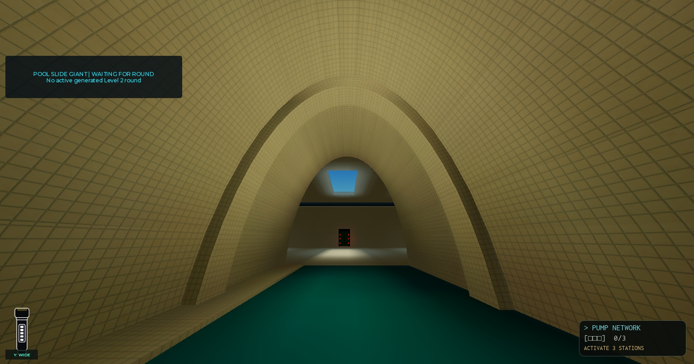
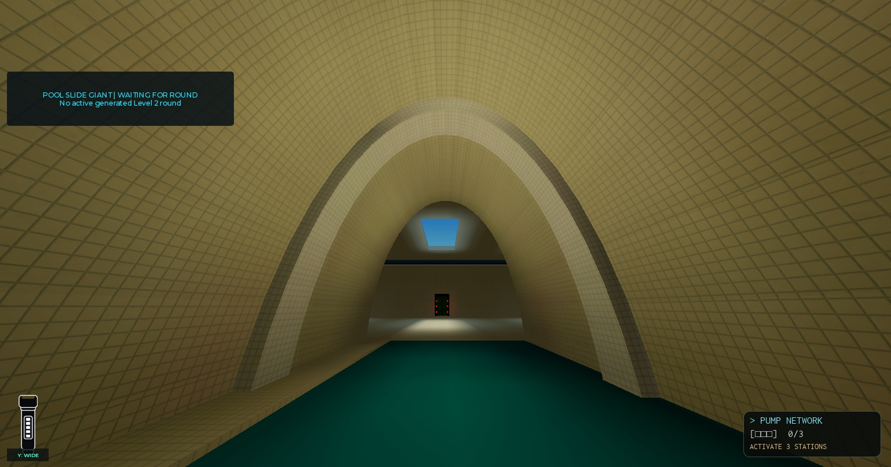
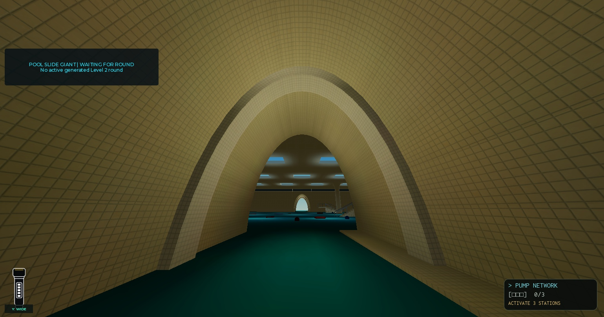

# Codex-verifikation og mesh-assets — 23. september 2026

Spilkode: Claude. Codex har gendannet testværktøjet, kørt eksisterende tests, uploadet
to buer, sat asset-backed MeshPart-templates ind, kontrolleret billeder og kollision,
taget native backups og publiceret **v2005**. Ingen Lua-kilde er ændret.

## Publicering og Studio

- Place `131311258779917`, universe `10559217407`.
- Roblox-kvittering: [publish-log.txt](publish-log.txt), **10:58:47 UTC**.
- Kodebaseline: `24d62b1` på `claude/trello-20260921`.
- 168/168 scripts matcher repo; 168 editor-kilder matcher Source.
- [Compile-kontrol](compile-check.txt): 168/168, ingen fejl eller ustagede scripts.
- Level 4 er fortsat dev-only. `ArchMeshRibs=false`; ingen Edit-seed, pause- eller mesh-overrides.
- Claudes fulde UIRegression-kørsel med 0 fejl er dokumenteret i handoffet. Codex har
  ikke genkørt den; denne session ændrede ingen UI-kode.

## Luau og offline-kontrol

[Officiel Luau 0.737-release](https://github.com/luau-lang/luau/releases/tag/0.737).
`luau-windows.zip`: 3.122.635 bytes, SHA256
`8cd28be648f3e5cc4bfc977d2344e43540ade5f3524440b171eecf54d3a4fb7c`.
Downloadens hash matchede GitHubs release-digest før udpakning og kørsel.

Ved næste kørsel i PowerShell:

```powershell
$env:LUAU_BIN = 'C:\Users\mikke\AppData\Local\CodexTools\luau\0.737\luau.exe'
```

14 eksisterende suiter, **39.916 checks**, alle bestået. Tabellen er et resultatresumé,
ikke en uredigeret stdout-log. Hver fil blev kørt som `python tools/tests/<navn>.py`.

| Test | Checks |
|---|---:|
| test_daily_rewards | 370 |
| test_daily_rewards_client | 503 |
| test_daily_rewards_page | 521 |
| test_death_advice | 116 |
| test_item_inventory | 87 |
| test_level1_relay_spawns | 43 |
| test_level2_tunnel_height | 33.822 |
| test_level3_first_cd_prompt | 18 |
| test_lucky_wheel_client | 557 |
| test_rail_dots_intro | 20 |
| test_zyntra_analytics | 111 |
| test_zyntra_store_compact | 538 |
| test_level4_plan | 3.172 |
| test_level4_neighbour_brain | 38 |

Den første liste medtog også `test_field_notes.py` og `test_retry_guide.py`; begge
gav file-not-found, fordi Claude allerede havde slettet dem. Git-diffen bekræfter
sletningerne. De tælles hverken som kørte eller beståede tests.

## Buer: upload og kontrakt

Gruppens eksisterende `EnsureArchRibMeshTemplates` genererede de samme to
geometrifamilier som de redigerbare OBJ-kilder. Hver EditableMesh blev uploadet med
[AssetService.CreateAssetAsync](https://create.roblox.com/docs/reference/engine/classes/AssetService)
under gruppen `1039373905`. Begge kald returnerede `Enum.CreateAssetResult.Success`.
Efterfølgende Marketplace-readback bekræftede Mesh (type 4), gruppen og navnene.

| Familie | Mesh-asset |
|---|---|
| r13.20_vs1.90_fd1.50_a3.20_d2.20_s26 | 121489049526127 |
| r13.20_vs1.90_fd1.80_a3.20_d2.20_s26 | 105818906248010 |

[arch-assets.json](arch-assets.json) indeholder paths, egenskaber, kildehashes og
readback. Templates ligger i ServerStorage under `Level 2 Arch Rib Mesh <familie>`.
Den eksisterende loader adopterer dem som første prioritet; ingen config-kode er
ændret. De to midlertidige object-backed templates blev konverteret til asset-backed
indhold, og editor-only-markeringen blev fjernet. Intet blev slået til i live-konfigurationen.

## Visuel A/B og kollision

Studio solo, generator kaldt direkte, fjender pauseret, ingen aktiv GameManager-runde.
Seed **1182081016 → 1182604661**. Standardribbe 1.1, kamera
`(-570.55023, 6, -289.50378)` mod `(-570.55023, 12, -305.50378)`, FOV 100.
De gemte klientbilleder er 1539 × 809.

| Måling | A: Parts | B: uploadede assets |
|---|---:|---:|
| Descendants i Level 2-world | 71.771 | 56.001 |
| Texture-instanser | 42.051 | 29.103 |
| Part-instanser | 25.164 | 22.176 |
| MeshPart-instanser | 2.355 | 2.521 |
| Ribber med mesh | 0 | 166 (157 fd1.50 + 9 fd1.80) |

Begge asset-familier viser buens åbning, korrekt placering og fliser på klienten.
Den tidligere bounding-box-placeholder er væk. Sammenlign:







Kollision i B: 8 usynlige fødder pr. ribbe; mesh `CanCollide=false`.
6 × 6 × 6-studs body-box ved ribbe 1.1's åbning fandt **0** kolliderende dele.
Vandrette stråler mod foden ramte ved 12,087 studs (y=0), 11,706 (y=6),
11,193 (y=9). Ved y=11 og y=14 ramte de den bevarede Vault Strip-shell.

Denne kontrol beviser geometri/rendering og de angivne lokale kollisionsforespørgsler.
Den beviser ikke aktiv jagt, sikker spawnafstand i multiplayer, navigation/retry/reset,
CPU/hukommelse, streaming eller mobil-FPS. Derfor forbliver piloten **slukket**.
Historiske CPU/frame-tal fra 22/9 må ikke overføres til disse assets; den gamle
måling var af en tidligere B-prototype. Runtime-testen blev afsluttet med Stop,
så kamera, karakterankring, pausering og seed ikke blev gemt i Edit.

## Native backups (kun lokale filer)

| Fil | Bytes | SHA256 |
|---|---:|---|
| baseline-before-assets.rbxl | 9.435.856 | 346075830048518b40b956f53dafb1ae2f61a23d83cb5b725160f4f6879671ba |
| verified-release-with-arch-assets.rbxl | 9.437.399 | 626c83f8db6e8059b229246e53be893b9ee1f0c8d45e8739a7cf1c2c940935ab |

Begge er gemt med Studios **Download a Copy**. Den sidste indeholder de to
asset-backed templates. En script-mirror alene genskaber ikke disse instanser.

## Til Claude

Luau-download og publicering er afsluttet. Brug den permanente `LUAU_BIN` ovenfor.
Upload-blokeringen for buerne er fjernet: fortsæt fra de to eksisterende templates,
og test den aktive runde før aktivering. Undgå gen-upload af de samme assets.
Rewards-introens eksisterende adfærd (én gang også for tidligere spillere) er bevaret;
ingen ny ejerbeslutning er antaget. Level 1 med 4–6 spillere og fysisk mobiltest er åbne.
