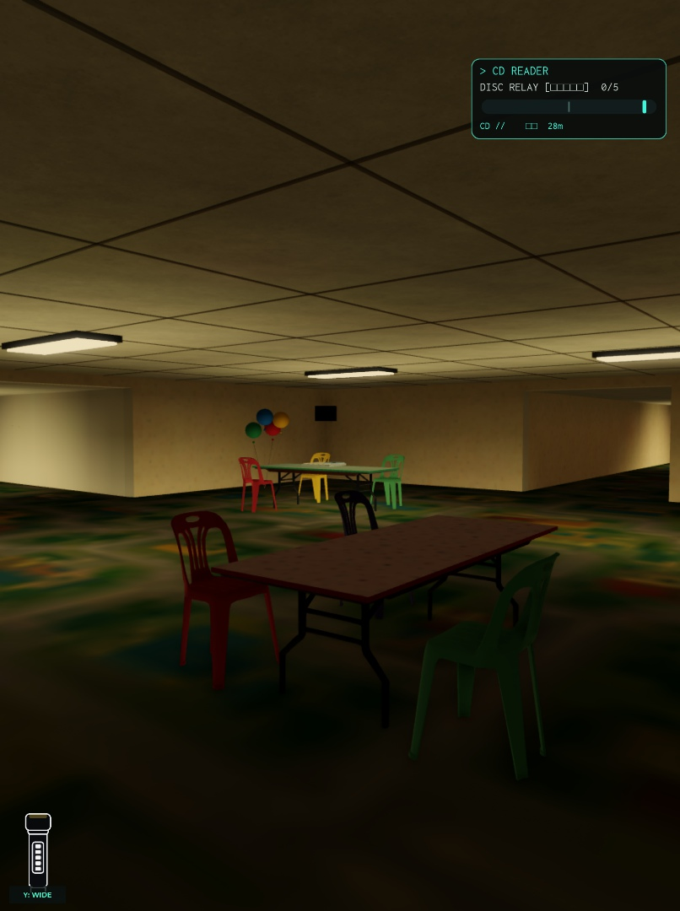
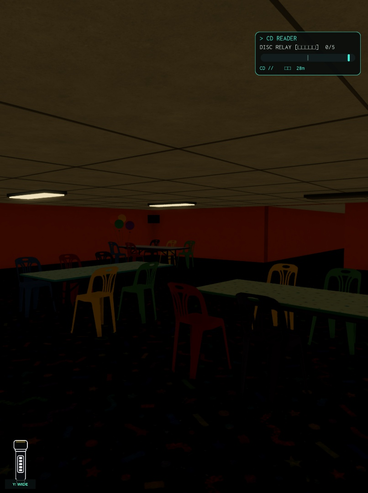

# Level 3: analyse og forslag til et modulært Blender-map

29. september 2026 · Backrooms: Stay Quiet · Studio place `131311258779917`, universe `10559217407`, version **2403**.

**Anbefaling:** Byg Level 3 af genbrugelige Blender-elementer, som Roblox placerer på en valideret rumplan. Første leverance bør være fem tydelige rumtyper med et fælles kit på cirka 10–12 assets. Derefter forbedres forbindelsesgeneratoren, så variationen også kan mærkes i ruterne.

Det er en analyse og en byggespecifikation. Der er endnu ikke modelleret eller importeret nye assets, ændret gemte spilobjekter eller publiceret en ny spilversion.

## Hvad der faktisk er undersøgt

- Repository-status og aktuel GitHub-historik blev læst før arbejdet. Det lokale checkout har ingen konfigureret remote og indeholder omfattende eksisterende ændringer. GitHub blev derfor læst særskilt via API; seneste observerede commit var `254f04f576f3e85a0fc17e61513df215c6a0a062`. Der er ikke synkroniseret eller gendannet noget fra GitHub til Studio.
- **16 relevante scripts** blev læst direkte gennem Studio MCP. `Source` og editor-source var ens for alle 16. De eksakte filer, klasser, paths og SHA-256-hashes ligger i [Studio-manifestet](studio-source-manifest.json).
- Aktuelle Level 3-overrides i `ReplicatedStorage.MasterTuning` var tomme. Målangivelserne nedenfor gælder derfor den observerede konfiguration; senere overrides skal aflæses på ny.
- En midlertidig Play-session byggede det fysiske Level 3 med **seed 101** gennem den eksisterende generator. To rum blev visuelt inspiceret, og objekter samt centerbaserede synslinjer blev målt.
- I samme midlertidige server blev **1.000 layoutplaner**, seeds 1–1000, genereret og deres forbindelsesgrafer sammenlignet. Der blev kun bygget én fysisk verden, ikke 1.000 komplette runder.
- Play blev stoppet. Alle 16 gemte scripts blev genlæst: **ingen ændringer og ingen editor-konflikter**. Ingen genereret Level 3-verden eller fast seed blev efterladt i Edit.
- Blender MCP er tilgængelig. Denne opgave brugte forbindelsen til at bekræfte værktøjsadgang; der blev ikke foretaget Blender-redigeringer.

Dette snapshot er et afgrænset kilde- og analysegrundlag. Det er ikke en komplet native place-backup eller en erklæring om repository/Studio-paritet for hele spillet. Ved en senere gameændring skal en fuld native backup og en ny live-baseline indgå.

## Det vigtigste fund: ruterne varierer kun på 36 måder

Den aktuelle standardgenerator har **26 rum og 31 forbindelser**: tre distrikter med otte rum hver, plus Arrival og Exit. Den indeholder seks uafhængige grafcyklusser, fordelt inde i distrikterne. Overgangene mellem distrikterne er enkelte forbindelser; man kan ikke løbe en alternativ rute rundt om et helt distrikt.

I hvert distrikt fjernes én af de ti mulige forbindelser på et 2 × 4-gitter. Derefter bygger generatoren syv forbindelser og tilføjer to ekstra. Alle ni tilbageværende forbindelser kommer dermed med. Den randomiserede søgerækkefølge giver ikke flere forskellige kantmængder ved disse indstillinger.

Resultatet er **36 strukturelle kombinationer**. Det blev både udledt af live-koden og observeret i alle 1.000 samplede seeds: **36 unikke grafer, nul generationsfejl**. Rumstørrelser, indretning og CD-placeringer varierer yderligere. Derfor kan to baner se forskellige ud, men stadig have samme forbindelsesstruktur. [Rå målinger og tre eksempelplaner](topology-sample.json)

Generatorens eksisterende `LayoutHash` omfatter mere end forbindelserne. Den kan ikke bruges alene til at love en ny rute. En særskilt topologihash skal bygge på normaliserede rum-ID'er og sorterede forbindelser, uden seed, møbler eller linkrækkefølge.

Der er allerede nyere beskyttelse mod lange lige forløb: højst tre lige links generelt og to langs nord/syd-aksen, med finalen behandlet særskilt. Det er relevant arbejde, som skal bevares. Den lokale repository-kopi var ældre i fem af de undersøgte scripts; forslaget bygger på Studio-versionen.

## Hvad der vil gøre mappet visuelt bedre

De inspicerede rum har store, flade vægflader, ensartede lave lofter og gentagne bord-/stolegrupper. Farve, tæppe og pynt skaber meget af forskellen. Den største mulighed er at give rummene forskellige, genkendelige arkitektoniske træk og tydelige passager.

En god rumfamilie bør have en tydelig hovedform, ét genkendeligt element og nogle få kontrollerede variationer. Gentagelsen skal føles som samme bygning; ophold, sving og opgaver skal give forskellig rumoplevelse. Færre tilfældige props og bedre komposition kan være et større løft end flere polygoner.

Den foreløbige Aero-retning fra husreferencerne er hvide afrundede paneler, cyan/blå felter, limegrønne accenter, perioderigtige skærme, kunstplanter og enkelte blanke overflader. **Intet vand, ingen fontæner eller akvarier.** Den endelige stilafklaring er stadig åben: bevare party/mall, vælge Aero eller blande dem. Kitkontrakten understøtter alle tre uden at kræve en ny rutegenerator.

| Rumtype | Det spilleren genkender | Variation, som modulet skal kunne rumme |
| --- | --- | --- |
| Velkomstrum | Stor indrammet indgang, skiltning og tydelig første opgave | Alternative sideåbninger, panel-/farvevariant |
| Lounge | Afrundede siddegrupper og en tydelig fri gennemgang | To eller tre aktive sider, flyttede dekorationsgrupper |
| Medierum | Skærmvæg eller musik-/arcadeområde | CD-rig, skærmgrafik og to godkendte møbleringer |
| Galleri/overgang | Markante vægfelter og et visuelt retningsskift | Forskellige åbne/lukkede sider uden at blokere AI-passagen |
| Signalrum | Et stort, genkendeligt slutpunkt | Disc player og eksisterende finaleovergang på faste gameplayankre |

Det er **fem modultyper**, ikke et forslag om at reducere Level 3 til fem rum. Den aktuelle runde og validator kræver den fulde 26-rumsstruktur. Arrival har desuden sin egen høje slide-overgang, som skal behandles separat.

## Hvordan sektionerne skal bygges i Blender

Første udgave bør bruge **parametriske gulve, vægge og lofter i Roblox plus faste Blender-elementer**. Nuværende rum varierer fra 65–85 studs i bredde, 57–74 i dybde og 11–13 i højde. Det er allerede 1.134 mulige dimensionstripler. Et færdigt helt rummesh ville enten skulle strækkes eller kræve et nyt katalog af tilladte størrelser.

Blender-kittet får derfor faste portalprofiler, gentagne vægpaneler, hjørner, sokler, armaturer, skilte og møbler. Neutrale restfelter udfylder rum, som ikke går op i panelbredden. Møbler, buer, tekst og detaljer får ikke vilkårlig strækning.

- **Samlinger:** Navngivne tilslutningspunkter, kaldet sockets, angiver placering, retning og den åbning, der skal holdes fri. Ubrugte rumåbninger lukkes med vægfelter.
- **Mål:** Almindelige portaler skal bevare **14 × 10,5 studs frit volumen**. En dekorativ bue må ikke snævre ind i hjørnerne. Gulvpivot, anvendte transforms og enhedsskala verificeres med et kalibreringsobjekt før assetproduktionen.
- **Metadata:** Blender-Empties og en JSON-sidecar beskriver sockets, rumtype, størrelse og gameplayzoner. Et eksplicit importtrin opretter Roblox Attachments/markører; vi antager ikke, at standardimport alene bevarer al denne betydning.
- **Kollision:** Simple Roblox-dele bærer gulv, vægge og nødvendige møbelkollisioner. Visuelle meshes får ingen utilsigtet fysisk blokering. Syns-/query-proxies skal stemme overens med det, spilleren ser.
- **Bibliotek:** Hvert unikt mesh importeres én gang og klones fra et versionsopdelt templatebibliotek. Arkitekturen deler teksturer og materialer. Roblox beskriver netop genbrug af MeshId og teksturkarakteristika som relevant for instancing. [Roblox: performance](https://create.roblox.com/docs/performance-optimization/improve)

En senere version kan bruge hele præfabrikerede rum fra et mindre størrelseskatalog. Det kræver en bevidst ændring af generatoren og MasterTuning, frem for blot en assetimport. Buede gangforløb, forskudte døre og flere etager kræver yderligere navigationarbejde.

Den detaljerede [Blender-/importspecifikation](blender-kit-review.md) indeholder pivot, aksekonvertering, sidecar-eksempel, konkrete assetmål og eksportmanifest.

## Hvordan der kommer mere variation ved hver runde

Blender leverer de genbrugelige dele. Roblox skal fortsat vælge og validere forbindelserne ved rundestart.

1. **Adskil tilfældighed for ruter, rumvarianter og pynt.** I dag deles én RNG-stream. Hvis antallet af dekorationsvalg ændres, kan samme seed pludselig give en anden rute. Gem generatorversion og kitversion sammen med seed.
2. **Variér selve grafen og loopbudgettet.** Bevar 26 rum, men prøv eksempelvis 1–2 loops pr. distrikt: 28–31 forbindelser og 3–6 cyklusser samlet. Det kræver en eksplicit ændring af validatoren og generatorversionen. Færre interne forbindelser giver plads til forskellige distriktsovergange uden at bryde reglerne for lange lige gange. Connectivity, svingkrav og finale skal stadig valideres. Det reelle antal gyldige grafer skal beregnes; der loves ikke et uverificeret antal kombinationer.
3. **Mål rutekvalitet.** Rapportér korteste veje til mål, lange lige synslinjer, korte blindgyder og CD-spredning. Et loop skal være en brugbar flugtvej, og en blindgyde skal have en begrænset straf eller en opgave, der gør besøget meningsfuldt.
4. **Undgå straks at gentage den foregående graf.** Sammenlign den nye topologihash med seneste runde. Det giver en kontrolleret forskel mellem runder; ubegrænset unikhed loves ikke.
5. **Sæt derefter passende rumvarianter på planen.** Modulvalget må kun bruge åbninger, størrelser og dekorationszoner, som matcher forbindelserne og gameplayrollerne.

Hvorfor ændre loopbudgettet? Med ni interne forbindelser kan hvert distrikt kun mangle én kant. De eksisterende entry-/finaleregler kræver bestemte brud, og forskellige gatewaykolonner kan kræve to lodrette brud i mellemdistriktet. Tilfældige udeladte kanter og uafhængige gateways alene er derfor ikke et dokumenteret løft med den nuværende faste 31-links-kontrakt.

Flere samtidige overgange mellem distrikter og helt frie grundplaner er en senere udvidelse. De berører progression og AI, og bør ikke blandes ind i den første artimport.

## Gameplaykrav, som et flot modul ikke må ødelægge

- Mall Manager er fysisk større end spilleren: radius 5, sweep-radius 5,25 og højde 10 studs; pathfinding bruger radius 4. En passage skal prøves med monsteret og møblerne på plads.
- AI'ens nuværende rum- og reparationslogik antager rektangulære rum, fladt gulv og centrerede døre i kardinalretninger. Visuelle kurver kan godt bruges omkring dette frirum. Frie kurver i den faktisk gåbare rute kræver en ny kontrakt.
- **Alle fem CD'er** skal have hver sit entydige hide-anchor højst tre studs væk i gulvplanet. Gemmebordenes anchors, prompts, kollisionsdele og synsafskærmning skal følge med under den nye bordmodel.
- Musik, blackout, scream-markører, Manager-spawn, disc player, slide-overgang og finale skal beholde deres controllerforbindelser. Nye lysende materialer må ikke stå permanent tændt under blackout.
- World Builders returmanifest skal fortsat levere de eksisterende felter, som round adapter, objectives og controllers bruger. En ny assetmodel alene er ikke en færdig integration.

## Performance: det målte og det endnu uprøvede

Seed 101 byggede på cirka **0,39 sekunder** i denne Studio-session. Det er én lokal observation, ikke et generaliseret performance-resultat.

Den efterfølgende inventory viste **2.676 Parts, 162 MeshParts, 20 WedgeParts og 110 lys**. De 162 MeshParts brugte kun **to forskellige MeshIds**; der er allerede genbrug af eksisterende møbler. Der var 1.162 collidable dele og 1.230 query-dele. Build-readback talte 3.739 descendants; den senere inventory summerer til 3.741. Det er separate tidspunkter, og årsagen til forskellen er ikke dokumenteret. [Inventory](runtime-seed101-inventory.json)

882 dele havde delvis transparens. Det omfatter forskellige overflader og må ikke omtales som 882 glasruder. Der er ingen dokumenteret GPU-flaskehals i denne analyse. Et nyt Blender-kit er heller ikke automatisk hurtigere: meshfragmentering, forskellige materialer, lys, overdraw og kollision kan stadig koste. [Roblox: optimeringsarbejdsgang](https://create.roblox.com/docs/performance-optimization)

Den eksisterende centerbaserede sightline-probe målte 100 rumpar; 46 havde fri stråle, og den længste var 312 studs. Det er en afgrænset kontrol, ikke en fuld analyse af alle kameravinkler. Den særlige 560-stud-finalekorridor er ikke dækket af dette kernemål. [Testresultat](topology-sample.json)

**Ikke verificeret:** en fuld normal runde, aktiv jagt, alle fem CD-interaktioner, multiplayer, server CPU/hukommelse under belastning, mobil GPU/FPS, streaming under bevægelse og gentagne reset-cyklusser. Play-inspektionen byggede Level 3 direkte og er ikke en erstatning for disse tests.

## Foreslået byggeforløb

| Trin | Konkret leverance | Skal dokumenteres før næste trin |
| --- | --- | --- |
| 1. Modulprøve | Portal, vægpanel og armatur i Blender samt sidecar | Mål, skala, pivot, sockets og 14 × 10,5 frirum i Studio |
| 2. Rumprøver | Fem typer som isolerede fixtures, inklusive min-/max-rummål | Spiller/Manager-passage, CD/hide-rig, lys og blackout |
| 3. Ét integreret distrikt | 10–12 assets og gennemarbejdet indretning i den fulde eksisterende generator | Alle gameplayroller samt visuel kvalitet på en faktisk rute |
| 4. Mere varierede ruter | Versioneret generator med separate RNG-streams og topologihash | Connectivity, finale, svingkrav, grafvariation og reproducérbare fejlseeds |
| 5. Fuld kvalitetstest | Samme seeds før/efter, aktiv jagt, 1-/6-spiller-scenarier og mindst tre resets | CPU/GPU/hukommelse, retries, fastkørsler, cleanup og målplatformens frame time |

Den nuværende graf bør få et fast regressionssæt med én repræsentant for hver af de 36 topologier, suppleret med ekstreme rummål og kendte fejlseeds. Nye grafklasser skal føjes til efter ændringen. Rene layouttests er hurtige og nyttige, men de fysiske og aktive runder skal også køres.

Efter godkendte gameændringer gælder ejerens workflow: frisk Studio-baseline, native backup, scoped writes med baselinecheck, verificeret eksport, reviewet commit og publicering af den eksisterende experience. Denne analyse medfører ingen publicering.

## Astra og Claude er faktisk brugt

**Astra (`gpt-6-astra`)** gennemgik generator, navigation, gameplaykontrakter og modularkitektur. **Claude Opus 5.5 (`claude-opus-5-5`)** blev kørt gennem den installerede Claude Code med et afgrænset kildeinput og uden værktøjsadgang. Modelnavnet fremgår af CLI-resultatets `modelUsage`; der er ikke blot skrevet et forslag til, hvordan modellerne kunne bruges.

Claude fik først et foreløbigt lokalt input og derefter en opdatering med live-koden. Det sidste review erstatter de uverificerede antagelser i det første. Begge modeller anbefaler faste Blender-detaljer på den variable rumskal og en særskilt senere forbedring af grafen. Root-agenten har sammenholdt rådene med Studio, runtime-observationer og de 1.000 layoutprøver.

En praktisk arbejdsdeling fremover er: Astra ejer kontrakt og rutearkitektur, én Blender-agent producerer kittet, Claude laver uafhængigt kode-/eksportreview, og én integrationsagent skriver til Studio. De deler det samme manifest og en frisk live-baseline. Flere modeller skal ikke samtidigt redigere de samme scripts eller sceneobjekter.

- [Astra-review](astra-review.md)
- [Blender-kit-review](blender-kit-review.md)
- [Claude-review med rootens faktuelle præciseringer](claude-review.md)
- [Råt Claude-resultat fra live-input](claude-live-review-result.json)
- [Verifikations- og modelrecord](analysis-record.json)
