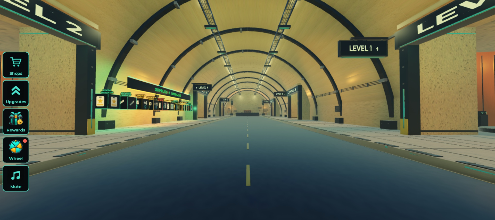
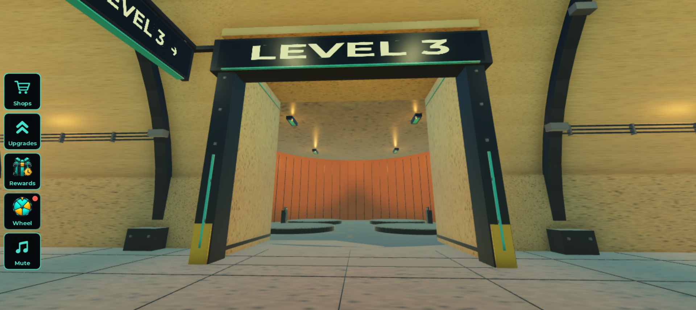
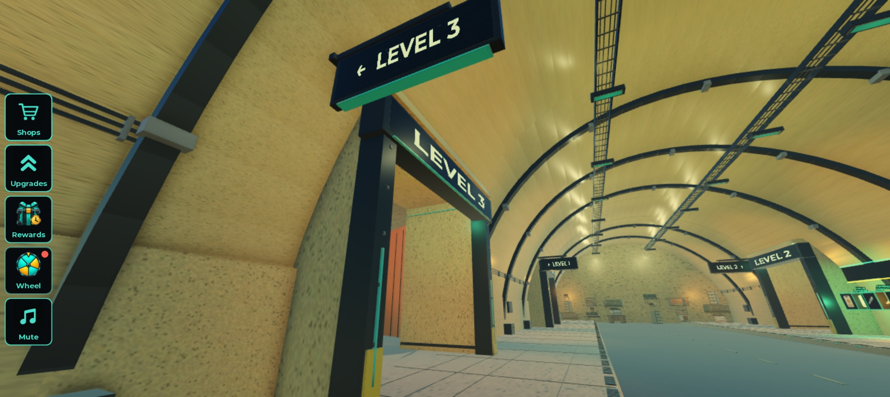
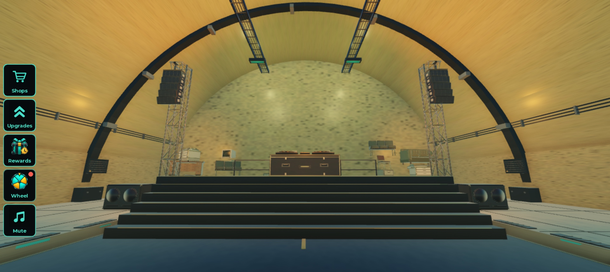
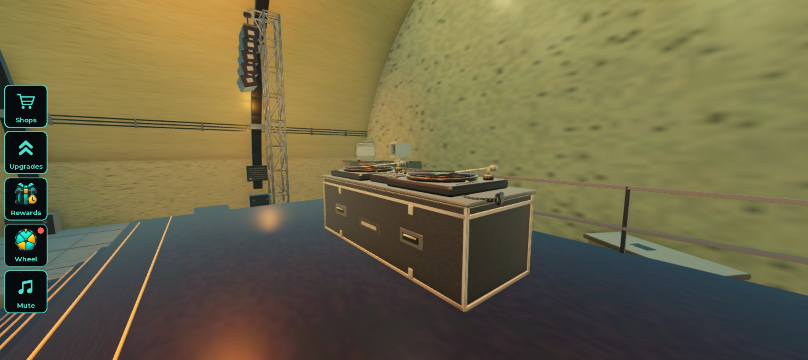
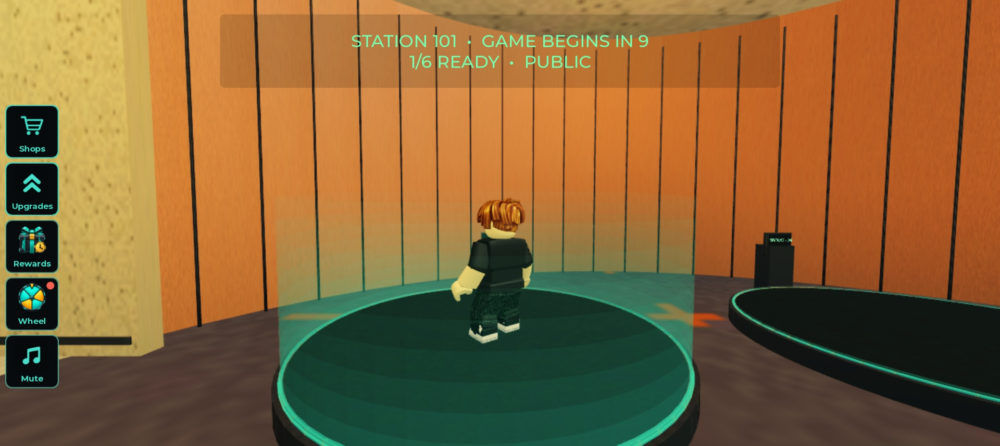

# Revised lobby R3B — verified Studio revision

The revised lobby remains beside the original at center `(220,30,-760)`; the original stays at `(0,30,-760)`. It is built from the actual Blender scene and baked from the saved R3B payload when a Studio or authorized developer player joins. It does not replace the original lobby.

## Completed corrections

- Rebuilt all six doorway headers at their physical lintels. Projecting signs have two readable faces, correctly directed arrows, steel booms above the lettering, and no support crossing the text. Moved the connector cheeks behind the jamb faces to expose the steel, cyan strips and hazard feet.
- Added closed entry connectors, overlapping walls and roofs, circular-bay upper friezes, continuous sidewalks and sealed end walls. Mounted revision notices against the wall; grounded stage stairs, speaker supports, furniture and service details. Added the stage rear railing.
- Connected the twelve Level 1–3 pads to the existing server queue engine, retaining its party UI, capacity, countdown, cancellation and level generation. Added owned preview entry hosts to the active Level 4 V4, Level 5 and Level 6 controllers without widening their access policy.
- Hologram rings and ten wall bands follow real server queue state, rise about six studs, and fade upward. Added shop focus plates that use the existing product card/purchase path. No purchase was made.
- DJ vinyls rotate around fixed centers at 12 degrees per second. The console and its pickup needles stay fixed. The stage can be reached using its six normal walkable steps.

## Actual Studio checks

Four post-import Play sessions used computer control, avatar navigation with normal walk speed and gravity, real GUI clicks and E/X input. The final geometry is manifest `c4289515c6253bf6414f745723a4466fbef59e9c40e179f13c14412349b72ba3`.

- Checked each doorway header from normal player height and every arrow sign from both tunnel approaches. Final R3B photos are under `playtest/r3b-*.jpg`; previous R3 tests and photos are retained as dated evidence, rather than represented as R3B captures.
- Walked onto all twelve campaign queue pads, checked the correct station/level captions, and cancelled each via X. Observed the real countdown and the upward opacity progression from 0.62 transparency to 1.0.
- Loaded the original Level 3 from its original station and from revised station 109. Both generated the existing 26-room Level 3 map with a living player and a valid floor.
- Held E to enter Level 6 through its revised kiosk; loaded the existing 32-room Level 6 and used E to return to the original lobby. The queue effect cleared on return.
- Walked through the Level 4/5 bays. Their four server preview prompts each exist; they remain inaccessible to ZenMeister02 under the unchanged access policy.
- Walked up the stage steps without jumping. Final vinyl measurement: 23.80194 degrees over 2.01507 seconds for each record, zero center drift, fixed console/needles, player health 100.
- Live collision queries on the preceding d242 geometry checked 4,908 floor/roof samples, all six entries, and all 24 queue cancellation clearances. Final c428 geometry received its own actual walkthrough and nine passing local geometry checks. FBX round-trip passed all 260 placements, AtlasUV/material routing, bounds and 153,484 triangles; 37 unique families contain 45,812 triangles, largest 9,844.

The final walkthrough found no remaining visible seams, clipping signs or blocked intended routes. End furniture stacks are deliberate barriers. The last screenshot attempt for a new hologram angle placed its camera inside a wall and is excluded; the earlier actual active-queue capture and measured fade remain the evidence, and this attempt is not claimed as a passed visual check.

## Performance and limits

One active Studio view on the preceding d242 geometry measured approximately 59.96 FPS over 120 frames, mean CPU 15.89 ms and GPU 9.16 ms; the earlier sample was about 15 FPS and its cause was not established. These are bounded local observations, not a final c428 performance measurement or a device/multiplayer guarantee. The preview has 524 runtime MeshParts including hologram bands, 85 non-shadow PointLights and 1,933 descendants.

Full Level 4/5 developer teleports have not been tested with an eligible account; ZenMeister02 is allowed for Level 6 but is not on the original general developer whitelist. Multiplayer, mobile and production-client navigation have not been tested. Existing access rules were preserved, not bypassed for testing. Level 2 gameplay was outside this lobby task.

The final Studio console also reported an animation access warning for asset `114302219876492` and waits for lazily created Level 6 remotes/state. The animation ID is absent from the revised lobby Sources and the captured Edit Animation instances; its origin and permission repair were not verified. Level 6 entry and return nevertheless passed in the actual session. Automation-only camera resets and CoreGUI mouse-target warnings are retained in the console record; they are not represented as gameplay failures or as passing input checks.

## Studio authority, review and recovery

The before/after native captures contain the full service-child forest plus service settings, assets, cross-references and all Sources. There are zero Source/editor conflicts and no skipped roots. The after capture contains 210 Sources: eight changed existing scripts, one new QueueBridge and 201 unchanged existing scripts. The dormant Level4PreviewAccess Source was restored; the active Level4V4PreviewAccess is the final edited controller.

Only two owned ServerStorage payload roots were added (R3 and R3B); previous payloads and unrelated content are retained. All service settings, collision groups/matrix and material overrides compare unchanged. The native .rbxl backups are local ignored recovery files under `native-before/` and `native-after/`; their hashes, Source manifests and verification reports are tracked. Conversion reports document 29 unsupported property assignments and 129 unreadable fields; the original serialized forest and settings capture are retained alongside the packed places.

`verified-studio-source/` contains the exact final changed Sources, and `verified-studio-source-manifest.json` records all 210 paths, classes and hashes. Install receipts record fresh baseline checks and Source/editor compare-and-swap writes. Historical intermediate receipts are retained for audit and are not instructions to push older Sources.

Claude Opus 5.5 at max effort reviewed the mounting/arrow and queue approach; Codex implemented the geometry and code, then independent agents checked source contracts, native scope and Blender geometry. Successful Claude response and receipt are in `claude-review/final-gate-decision.*`; earlier failed attempts are labeled in their receipts.

This checkout has no Git remote. Commit IDs identify local commits, not a GitHub push. Roblox Creator Dashboard confirms **published version 2459** with Show published only enabled; the receipt is `publication.json`. The loaded Edit PlaceVersion 2450 is a session value, not the current cloud version.

## Actual screenshots

