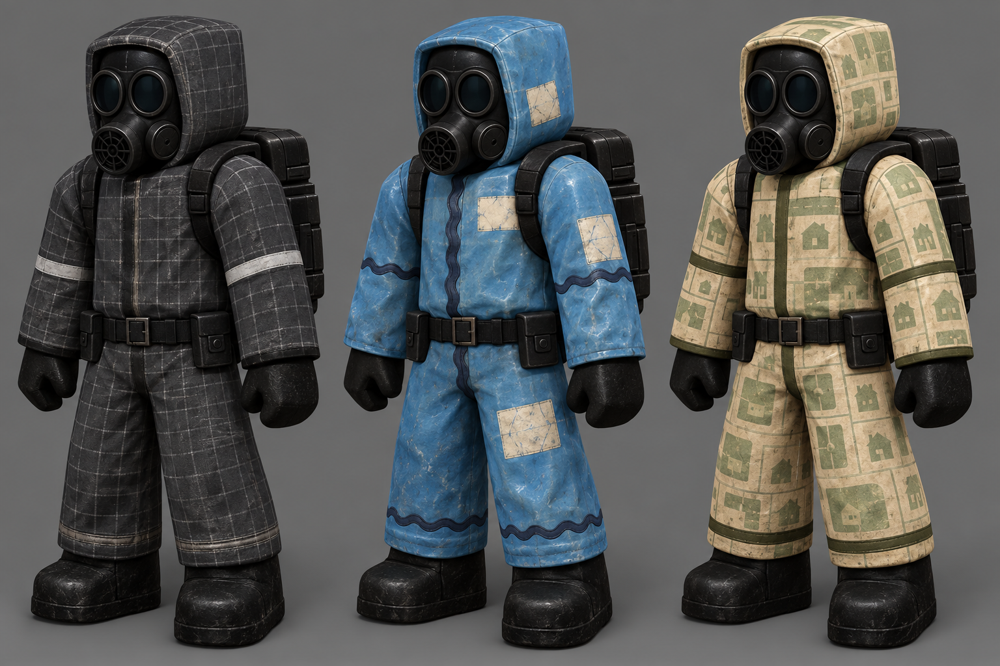

# Hazmat surface-skin trials — 23 September 2026

The three figures deliberately share the **same** suit shape, black respirator, gloves, boots and rear pack. From left to right:

1. **Containment Grid:** matte charcoal woven grid, sealed seams and a restrained neutral stripe.
2. **Pool Service:** chlorine-faded blue waterproof fabric, cream repairs and dark wave-cut seams.
3. **Suburb Survey:** dusty cream with sage lot-map panels and dark binding. The tiny house motifs in this first image should be simplified into abstract plot lines for a production texture.

This is a visual experiment for [Trello VSCGGIA9](https://trello.com/c/VSCGGIA9), **not** a UV texture atlas, Roblox asset, store product or approved price. The existing paid color selector is a separate benefit and must not be resold as a mere recolor. Each selected skin should be a pattern/material variant only, with zero change to hitbox, animation or gameplay stats. Final textures need the actual hazmat rig/UV source or verified Studio export, a 3D preview on that rig, mobile readability and the owner's product decisions before sale.

Generated with Codex built-in imagegen using `assets/marketing/roblox-thumbnails-v2/05-level3-cd-relay-mall-manager-hazmat.jpg` as a silhouette reference. Prompt direction: identical neutral full-body pose and equipment across three variants, change only fabric pattern/material, no labels, price, new gear, glow or gameplay effects. No game code or Studio instance was changed.
