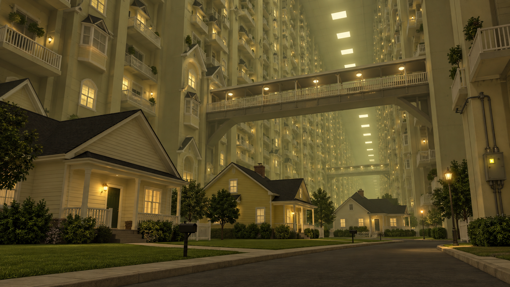

# Level 4 indoor suburbs — concept v1

Generated by Codex with the built-in imagegen tool on 23 September 2026 as a visual reference for **The Quiet Suburbs**. The brief follows `docs/LEVEL4_VIDEO_DIRECTION_2026-09-22.md` and the existing playable Level 4 prototype. This is original concept art, not a screenshot of the game or a finished Roblox texture.

Use the image for the relationship between a small playable suburb, repeated residential facades that rise far above the player, overhead walkways, and an unmistakable artificial ceiling. Build the first ground-level slice with three houses, two tall facade groups, one bridge, and a visible ceiling section before extending it to the full level. Keep objective houses and their anomaly markers readable from player height.

The many illuminated windows in the concept are an atmosphere cue, **not** a lighting budget. Reuse geometry, simplify high and distant floors, and follow the current Level 4 limits of 12 dynamic lights and 12,000 descendants until measured runtime evidence supports another choice. The game continues to use its own Zyntra signage, objectives, house attributes, entity, and art style. Do not use this concept as an ad or thumbnail claiming to show live gameplay.

Generation prompt: “A polished, buildable Roblox horror environment concept at player eye height. Three modest pale suburban houses and a lawn at ground level; around them impossibly tall repeating residential facades with gables, balconies and white railings; one overhead pedestrian bridge; a very high artificial ceiling with receding rectangular lights. Empty liminal atmosphere, restrained yellow-green ambience, readable house doors and routes, no characters, UI, text or watermark. Original architecture rather than a copy of the reference.”
