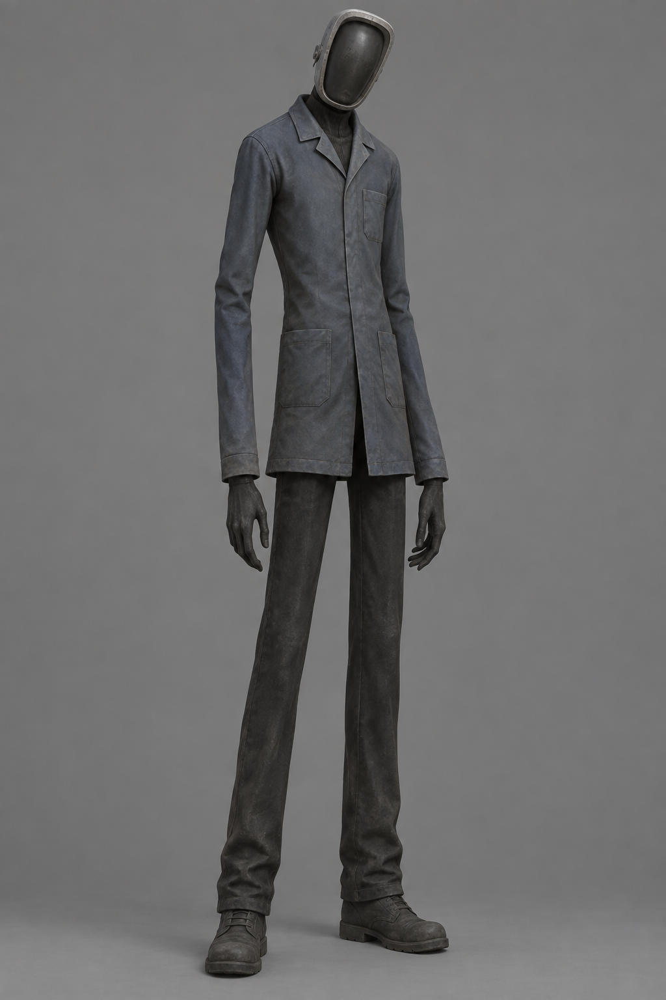

# The Neighbour — visual concept v1

> **Superseded 23 September 2026:** the owner cancelled The Neighbour. This image remains for historical reference only; the new Level 4 entity will be selected from `assets/concepts/level4-entity-options-20260923/`.

Original full-body character reference generated with Codex's built-in imagegen tool on 23 September 2026. This is a **concept image, not a mesh, rig or Roblox asset**. It gives a silhouette/material direction for the Level 4 entity: approximately 9.5-stud-tall, narrow shoulders, unnaturally long forearms, slightly tilted head, faded blue-grey maintenance clothing and a featureless matte smoked-glass faceplate. It avoids a formal suit/tie, glowing eyes, gore and weapons so the character remains a distinct Zyntra entity.

The runtime contract remains `docs/LEVEL4_CONTRACTS_2026-09-21.md` §6. The current entity is independently CFrame-posed anchored Parts. Before a mesh/animation replacement, Claude must specify how the named `HumanoidRootPart`, `Torso`, `Head`, `Mask`, arms, forearms and legs will be mapped into the new rig, how the head/footstep attachments stay in place, and how the state attribute drives Idle/Walk/Search/Chase/Attack clips. Codex can then author and upload the group-owned model and clips. Do not mark the Trello Level 4 card Done from this concept alone.

The four T-pose modeling references are in `assets/level4/neighbour/` with their scale and rig notes in its `README.md`.

Generation prompt, summarized: one original full-body figure in a neutral front-three-quarter studio pose; tall slim 9.5-stud silhouette, long forearms, faded blue-grey utility coat, dark trousers/boots, matte smoked-glass mask, restrained mild-horror style, lightweight rig-friendly forms, plain grey background; no existing famous horror character, text, gore, weapon or effects. Tool: built-in `imagegen`, not Higgsfield.
