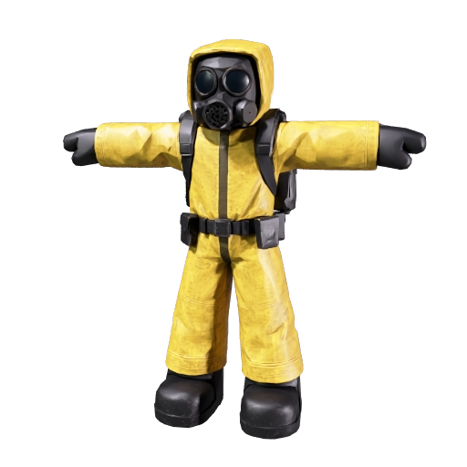
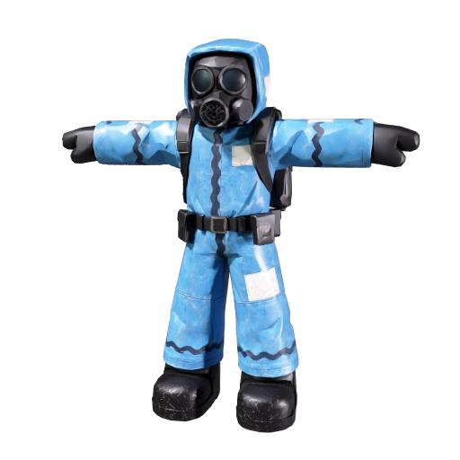
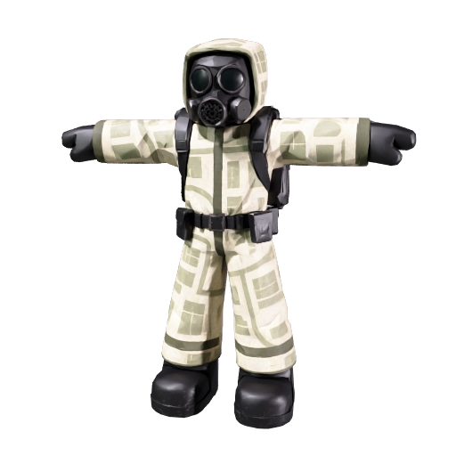
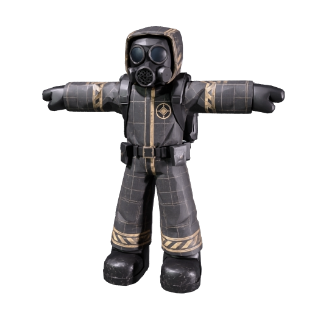
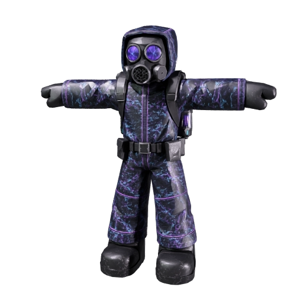
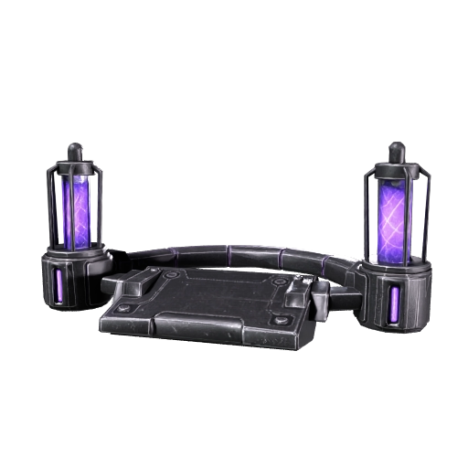
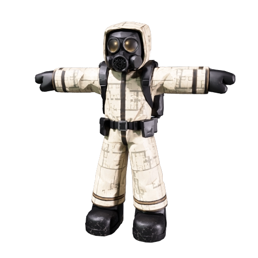
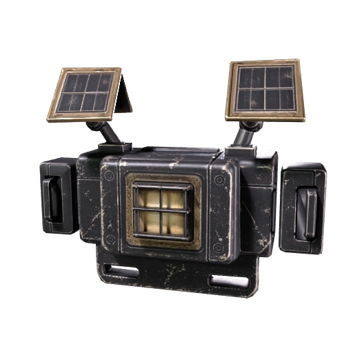

# Hazmat suit art package — 24 September 2026

This package is ready for Claude's Roblox Studio import and game-code work. It has **not** been imported into Studio, assigned Roblox asset IDs, tested in a live round, or published. Codex owns these art files and independent QA; Claude owns all game code and the Studio integration. The older instruction in `docs/CLAUDE_ALL_ACTIVE_TRELLO_2026-09-23.md` to skip skins was superseded by the owner's later request to make hazmat skins.

## Use these files

| Purpose | File | Notes |
| --- | --- | --- |
| Shared body and skeleton | `baseline-rigged.glb` or `baseline-rigged.fbx` | Use **one** canonical rig for all six looks. 10,180 triangles, 14,463 skinned vertices, 24 bones. The embedded clip is a static pose. |
| Walk clip | `walking-armature.glb` | Approximately one second; skeleton/rest transforms match the canonical rig. Verify Roblox animation import and deformation. |
| Run clip | `running-armature.glb` | Same skeleton contract as walk. Verify in Studio. |
| Baseline texture | `textures/baseline-yellow.png` | Free/default hazmat suit. |
| Pool Service texture | `textures/pool-service.png` | Token skin; candidate for the wheel's 5% random-skin pool. |
| Suburb Survey texture | `textures/suburb-survey.png` | Token skin; candidate for the wheel's 5% random-skin pool. |
| Blacksite Director texture | `textures/blacksite-director.png` | High-prestige Token skin; **exclude** from the wheel. |
| Static Wraith texture | `textures/static-wraith.png` | Robux skin, with `static-wraith-topper.glb` as an optional cosmetic backpack. |
| False Sun texture | `textures/false-sun.png` | Robux skin, with `false-sun-topper.glb` as an optional cosmetic backpack. |
| Wheel art candidate | `wheel/lucky-wheel-six-sector-random-skin.png` | Six equal visual sectors and a generic skin icon. Do not enable until the six-reward UI/spin mapping is updated and the owner confirms the wheel layout. |

For Studio's documented `.gltf` import route, `studio-import/` also contains lossless glTF copies of the two animation files and both premium toppers. **Keep each `.gltf` beside its `.bin` and image files in its own folder** during import. These are local format conversions of the same Meshy output, not extra generated variants or extra Meshy charges. The body already has an `.fbx` copy.

All six 2048×2048 color maps fit the **same UVs** on `baseline-rigged.glb`; the UV accessor is byte-identical across the six independently rigged Meshy variants. Keep the **canonical geometry and skeleton** for every skin, rather than loading six separately rigged bodies. If Studio imports a basic `MeshPart` texture, its [`TextureID`/`TextureContent` can be changed at runtime](https://create.roblox.com/docs/reference/engine/classes/MeshPart). If the import uses `SurfaceAppearance`, prepare one variant model per color map in Studio and clone the chosen variant; [Roblox says most `SurfaceAppearance` properties cannot be changed by game scripts](https://create.roblox.com/docs/reference/engine/classes/SurfaceAppearance). The independently rigged models have different bind poses and skin weights, so sharing one animation controller between those bodies is unsafe without retargeting. The final GitHub package deliberately omits them.

The two premium toppers are separate static GLBs: Static Wraith is 2,897 triangles and False Sun is 3,048. Their preview renders show the intended shape, not their attachment scale or behavior in Roblox. Attach them to the back with a separate cosmetic weld/bone after sizing in Studio. Keep hitboxes, detection, movement speed, noise, interaction reach, camera obstruction, and gameplay light radius unchanged. The toppers do not include actual animated effects.

Meshy rigged exports reference the whole color PNG as both `baseColorTexture` and `emissiveTexture`, with `emissiveFactor` `[1,1,1]`. **Remove/ignore the full-surface emissive on Roblox import**; otherwise the entire suit could self-light. If either paid skin gets a glow, make it a restrained, separate cosmetic effect and validate mobile performance and horror readability. The textures are 2K masters; load only needed variants and measure mobile memory before deciding if smaller imports are needed.

## Visual checks

The downloaded Meshy preview renders were inspected. They show complete T-posed suits, distinct colors, and both backpack shapes. The six-sector wheel PNG was checked at 1254×1254 RGBA with transparent exterior, six roughly 60° fields, and a generic blue/sage hazmat icon. At about 240 px, the skin silhouette remains readable but face details become small. **Equal sector art does not represent the weighted odds**: explicitly display `5%` in the UI and keep the server-side random selection independent of wedge area.

| Default | Token: Pool Service | Token: Suburb Survey | Token: Blacksite Director |
| --- | --- | --- | --- |
|  |  |  |  |

| Robux: Static Wraith | Static Wraith backpack | Robux: False Sun | False Sun backpack |
| --- | --- | --- | --- |
|  |  |  |  |

`source-refs/` holds front, left, and back images used to generate the baseline. `concepts/` holds the five skin looks and two backpack designs. The `*-preview.png` files are rendered Meshy previews. None proves Roblox R15 compatibility, realistic movement, mobile performance, or in-game look.

## Claude integration contract

1. Read `AGENTS.md` and current live Studio Source/editor-source before changing anything. Preserve other developers' work and make a native backup before non-script asset changes. These files are **inputs** for Studio import, not authority to overwrite Studio.
2. Import the canonical body and one or both animation clips into an isolated dev-only test. Prefer `baseline-rigged.fbx` and the `studio-import/` `.gltf` files for [Studio's documented 3D import formats](https://create.roblox.com/docs/studio/importer). Record every owned asset ID, import setting, and scale. Check mask, fingers, knees, backpack alignment, walk/run deformation, lobby and round avatars, deaths, respawn, other players, mobile, and memory before using it as the player character. The Meshy skeleton is **not asserted to be Roblox R15**; adapt/retarget rather than assuming compatibility.
3. If the base game character cannot safely be replaced, preserve its current movement and collision rig and treat the imported suit as a visual layer/attachment. Test that against the existing Advanced Equipment pass: its current benefit must remain intact and separate from cosmetic ownership.
4. Add server-authoritative owned/equipped skin persistence, price and receipt validation, shop preview, equip/unequip, and replication to other players. Never let a client claim ownership by sending a skin ID. Prevent duplicate Robux grants and preserve old player profiles. All skins remain cosmetic.
5. The owner is deciding exact Token tiers and Robux prices; **25 / 75 / 300 Tokens plus 100 lifetime clears for Director** is a proposal, not an approved price. No Robux price or product/game-pass ID is approved in this package. Do not activate paid offers with guessed IDs or prices. If historical lifetime clears are unavailable, define a fair migration before enforcing a clear gate.
6. For the proposed wheel skin prize, use a 5% server-side result that picks an unowned eligible skin from Pool Service/Suburb Survey; never include Director or Robux skins. Decide and document an all-owned fallback before release. Persist the actual `SkinId` at **spin time**, so a rejoin or deferred claim cannot reroll it. Grant atomically on `COLLECT PRIZE`, handle duplicate claims, and keep pending prizes from old wheel versions claimable. Current code has five rewards/fields and the existing 5% result is two Speed Potions; the owner has not yet chosen whether to add a sixth field or replace that result. Do not infer weights from the new art.
7. Verify purchase/ownership/equip across rejoin, simultaneous players, teleports, failed saves, and device sizes. Publish only after real Studio/live checks, update the relevant Trello skin card with evidence and version, and leave it open for any missing price/ID, device, or purchase test.

## Meshy provenance and cost

The CLI project is local at `assets/hazmat/meshy_output/20260924_001003_hazmat-baseline-20260924_01a0d051/` and is gitignored because its snapshots contain expiring signed download URLs. For later Meshy follow-ups, reuse these IDs instead of regenerating the model. All 17 tasks succeeded; the recorded total is **160 Meshy credits** (account balance after completion: **1,748**).

| Stage | Meshy task ID | Credits |
| --- | --- | ---: |
| Baseline, multi-image-to-3d | `01a0d051-6139-70a2-88a5-1999aaa29b8d` | 30 |
| Mobile-budget remesh | `01a0d056-45f0-71ae-b756-f5ddbf80bb54` | 5 |
| Pool Service retexture | `01a0d059-cc30-762b-ada8-34ebdc85e337` | 10 |
| Suburb Survey retexture | `01a0d05b-dd9d-75cc-97f5-43a716a99754` | 10 |
| Blacksite Director retexture | `01a0d05c-234b-7030-aae2-ec9e0b762089` | 10 |
| Static Wraith retexture | `01a0d05c-57a2-7582-b161-0356ddac7ab3` | 10 |
| False Sun retexture | `01a0d05c-8cdd-709f-ada3-6fc4a5d63b19` | 10 |
| Yellow baseline retexture | `01a0d063-6db0-7119-89c1-e91c5d4218f4` | 10 |
| Canonical body rig | `01a0d05e-e5e1-73ea-b8b0-9802fab8fd0a` | 5 |
| Pool Service rig study | `01a0d063-a099-75e7-9825-6531d5ae02f9` | 5 |
| Yellow rig study | `01a0d065-c087-72d8-86a0-5dafed9dd37f` | 5 |
| Suburb Survey rig study | `01a0d065-d702-7138-95f2-de0ecfabc598` | 5 |
| Blacksite Director rig study | `01a0d065-ec6c-728c-a51b-d89de4eb382a` | 5 |
| Static Wraith rig study | `01a0d066-0374-7169-893c-fe74b8c3576f` | 5 |
| False Sun rig study | `01a0d066-1ac4-716f-aa9c-feafa7031354` | 5 |
| Static Wraith backpack, image-to-3d | `01a0d068-ad7c-73ca-9dcf-40826b35e102` | 15 |
| False Sun backpack, image-to-3d | `01a0d068-f319-74a2-bab0-8b3bb1777c36` | 15 |

Source: Meshy task JSON `consumed_credits`; the public API price list is <https://docs.meshy.ai/en/api/pricing>. No extra Meshy run is needed for the current package.
