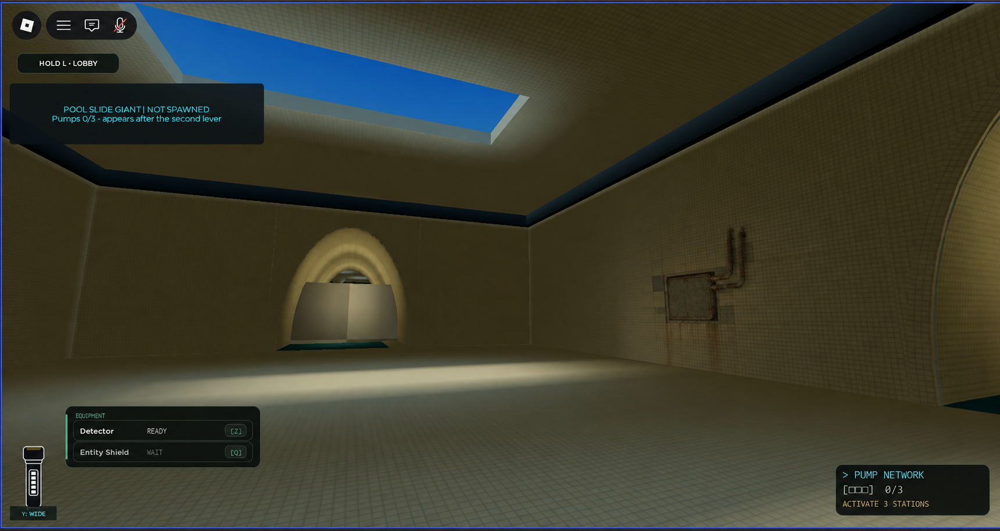

# Level 2 wall depth v2 — built-in service recess

Owner rejected the two flat Visitor Traces and Maintenance History decals after their v2081 publication. They read as pasted-on graphics and the pump stencil resembles an objective. Retire both runtime placements; keep their source files only for history.

This is an **ImageGen concept**, edited from the actual `artifacts/claude-20260922/screens/level2-corridor-B-mesh-ribs.jpg` gameplay view. It is not a runtime texture or an imported Roblox asset. The approved direction to prototype is rare, physical wall detail: a small recessed/tile-framed metal inspection hatch, one short blind pipe, replaced tile patches and restrained mineral damage following grout. No labels, buttons, lights, handprints, blood, graffiti or fake pump diagrams. Keep the panel above hand height and away from the real pump/exit route.

Runtime target: one or two native, static service recesses per generated Level 2 layout, within existing ordinary-hall wall-candidate geometry; roughly 5×4 studs, at most 10–15 simple parts per recess, zero collision/touch/query, no dynamic light. They must remain visually secondary to arches, enemies and objectives. Validate in a generated round at 8–15 studs and oblique angles, and measure phone FPS/memory before closing [DDqjXkyU](https://trello.com/c/DDqjXkyU).

Built-in ImageGen prompt, 24 Sep 2026: precise-object-edit of the above actual screenshot, preserving camera, arches, skylight, tile grid, water, HUD and lighting; add only a small recessed aged metal service hatch on one broad wall, subtle shadow gap, two short corroded pipe stubs, a few replaced cream tiles and mineral staining along grout. Avoid murals, handprints, blood, text, symbols, glow, interactive controls and other scene changes.
