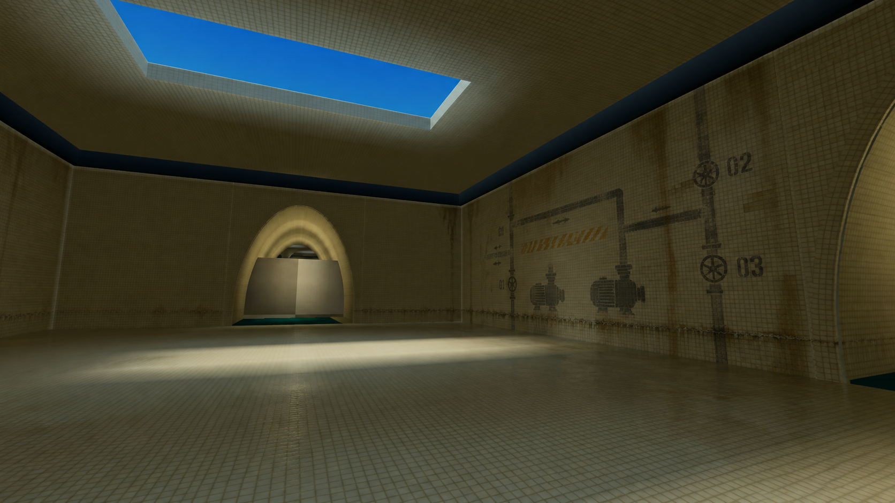
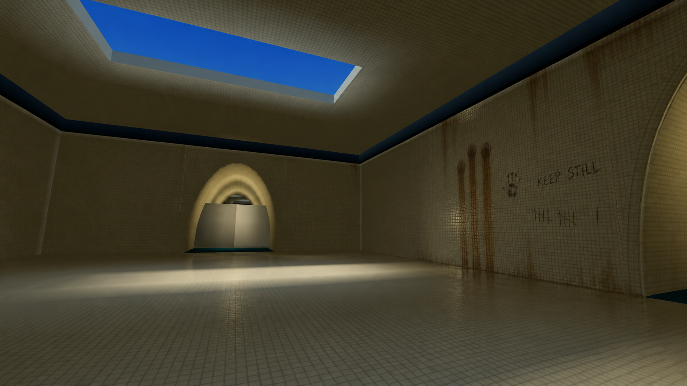

# Level 2 wall depth — concepts, not installed assets

Card: [DDqjXkyU](https://trello.com/c/DDqjXkyU). These two ImageGen sketches are painted over the actual Level 2 vaulted-room reference at `artifacts/claude-20260922/screens/level2-corridor-B-mesh-ribs.jpg`. They show how to break up the long cream-tile walls without changing the corridor silhouette or adding a new objective. The images are **art-direction mockups**, not decals or evidence of a Studio import.

## A. Maintenance history

Faded charcoal pump/valve diagrams, a worn amber stripe, small numeric stencils and a low waterline imply that the pool facility has been serviced for years. Use on a broad, relatively dry side wall after an arch or in a pump-adjacent service bay; avoid placing a fake diagram immediately beside an interactive pump, since players could mistake it for instructions. Keep most of the tile visible. Redraw numbers and arrows by hand before import; AI text and diagram paths are not authoritative.

## B. Visitor traces

Three long damp drag marks, a wiped handprint and a few scratched tallies imply that another person passed through. One rough phrase, `KEEP STILL`, is a thematic option, not a gameplay instruction. Use sparingly in a side alcove or quiet dead-end at shoulder height; do not put it on the critical route or near a pump where it could mislead. If a player test reads it as required behavior, omit the phrase and keep only the scratches.

## Placement and validation

- Treat both as small, rare accents across Level 2, not repeating wallpaper. Preserve the cream tile grid, arch silhouettes, sight lines to pumps/exits and Pool Slide/Pool Foam visibility. Do not place in Level 4/5.
- Build final wall graphics as separate transparent decals or thin noncolliding planes aligned to existing tiles. Repaint any words and symbols cleanly; these mockups include generated lettering and should not be uploaded whole as wall textures.
- Test at the game's usual dark lighting from near, mid-corridor and oblique views, including a low-resolution phone. A mark should resolve as a deliberate shape at roughly 8–15 studs without becoming a false objective marker. Reduce contrast or omit details that sparkle, alias or hide enemy silhouettes.
- Keep the decals static and unlit; compare draw count, memory and frame time before/after on a physical phone. An art sketch alone does not satisfy the Trello card. Claude/Studio integration and an active Level 2 round are still needed before Done.

## Generation record

Built-in ImageGen, 24 September 2026. Both runs used the actual screenshot above as an edit reference; no game code or Studio objects were changed.

Prompt A: `Use case: stylized-concept. Asset type: BACKROOMS: STAY QUIET Level 2 environmental art concept sketch for wall dressing, not a finished decal. Reference image is an actual in-game Level 2 corridor; use its architecture and lighting as a strict guide. Edit the reference scene: keep the cream square ceramic tiles, enormous vaulted arch, corridor layout, floor/water, cyan skylight, and overall dark empty-space atmosphere. Add only a restrained maintenance-history layer on one broad wall: worn charcoal pump diagram painted directly on tiles, a small faded amber hazard band and 2–3 stenciled valve numbers, thin dark waterline and irregular tile-scale mineral stains. The treatment should read at a glance from 8–20 studs, create depth and unease, and stay secondary to navigable edges, arch silhouettes and the player's pump objective. Show realistic material weathering, irregular age, not clean UI labels. No entities, no new doors, no extra props, no brand logo, no signs that imply a new objective, no watermark. 16:9 wide game-environment concept.`

Prompt B: `Use case: stylized-concept. Asset type: second distinct BACKROOMS: STAY QUIET Level 2 environmental wall-dressing concept, for art direction only. Edit the provided actual in-game vaulted tiled pool corridor as reference; keep its camera, geometry, cream square tile grid, large arch and open floor, shadow level and blue skylight. On one broad side wall, add a sparse human trace instead of an industrial schematic: three vertical hand-dragged wet rust-brown streaks, one partially wiped palmprint at shoulder height, irregular tally scratches carved across a few tile rows, and a broken short handwritten phrase 'KEEP STILL' in dark grease pencil. Keep it rough, localized, and unsettling, with most of the wall empty. Reflect water damage near the tile seam. It should suggest a previous visitor, not imply a new puzzle or traversal direction. Unlike a graffiti mural: maximum 10–15% of wall area, no bright colors, no glowing symbols, no blood splatter, no body/entity, no new props, no brand/logo/watermark. Ensure the phrase is exactly KEEP STILL if rendered, otherwise leave it as non-text scratch marks. 16:9 wide environmental concept.`
