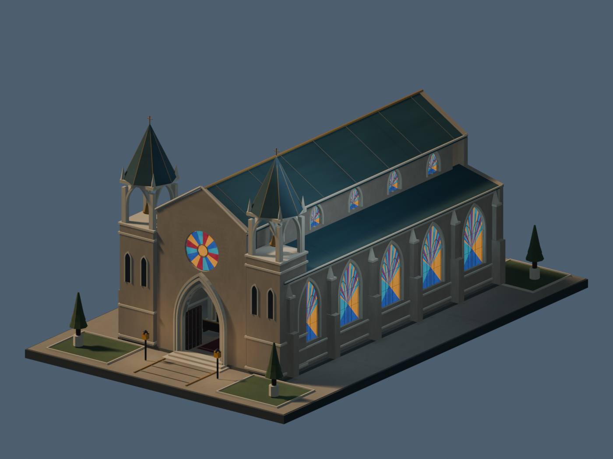
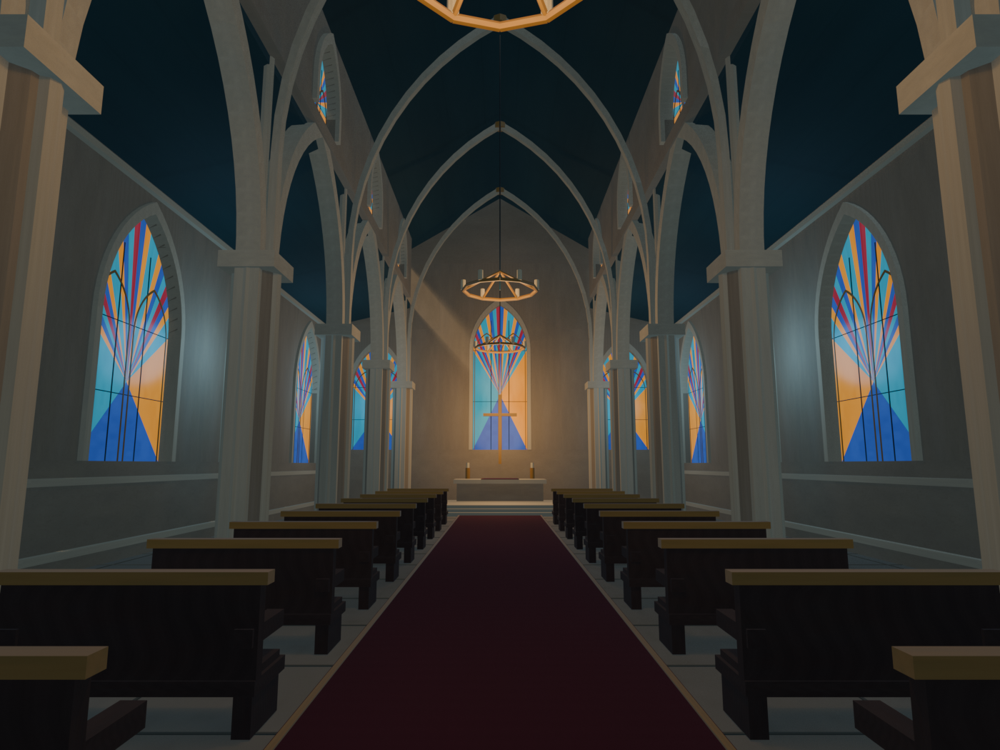

# Vesper Cathedral

An original, compact Gothic cathedral made in Blender for Roblox import. Warm limestone, teal slate spires, jewel-colored stained glass, a rose window, open oak doors, arcades, pews, chandeliers, an altar, and a small planted forecourt.

## Start here

1. Import **VesperCathedral.glb** into a separate Studio test place. Choose **Studs** for scale and keep the meshes separate.
2. Select the imported Model and run **SetupCathedral.luau** in the Command Bar to anchor it and add simple collision parts and local lights.
3. Walk-test the entrances, aisles, and altar steps before adding it to a game. Full instructions: [IMPORT_TO_ROBLOX.md](IMPORT_TO_ROBLOX.md).

The **FBX** is an alternative import, and **VesperCathedral.blend** is the editable source. Textures are embedded in the interchange files and included separately in `textures/`. The Blender file retains a separate default Scene; only the named cathedral scene is exported.

## Asset details

| Item | Value |
|---|---|
| Site footprint | 108 × 168 studs |
| Height, including foundation | 82.56 studs |
| Visual meshes | 104 |
| Total triangles | 66,736 |
| Largest mesh | 2,640 triangles |
| Materials | 2, with one material per mesh |
| Source textures | 1024 × 1024 base-color and roughness atlases |
| Setup | 114 simple colliders; 12 optional local lights |
| Paid generation | None; no Meshy credits used |

Closed geometry, normals, UVs, transforms, per-mesh triangle counts, and GLB/FBX roundtrip geometry have been checked. The exterior, nave, and sanctuary previews were rendered and visually inspected. These are **Blender previews**, not Studio screenshots; Roblox lighting and glass appearance will differ.

**Not yet verified:** actual Roblox Studio import, setup-script execution in Studio, avatar traversal, and runtime performance. No live game was changed or published. See `verification.json`, `collision-design-check.json`, and `creation-record.json` for evidence and limits.

All architectural geometry and textures were created for this asset; no third-party meshes, downloaded texture packs, or attribution-dependent assets are included. You may edit and use it in your Roblox projects.

## Rebuild in the repository

The repository keeps `tools/build_cathedral_palette.py`, `tools/build_vesper_cathedral.py`, `tools/export_vesper_cathedral.py`, and `tools/verify_cathedral_export.py`. Run the palette builder with Python, then the build and export scripts in a fresh Blender background process. Do not run the builder over an existing cathedral scene. The verification script checks the finished native and interchange files without changing the live Blender session.

The import archive contains the complete usable asset package; the repository also preserves the generation and validation tools. `package-manifest.json` records the delivery file hashes.
