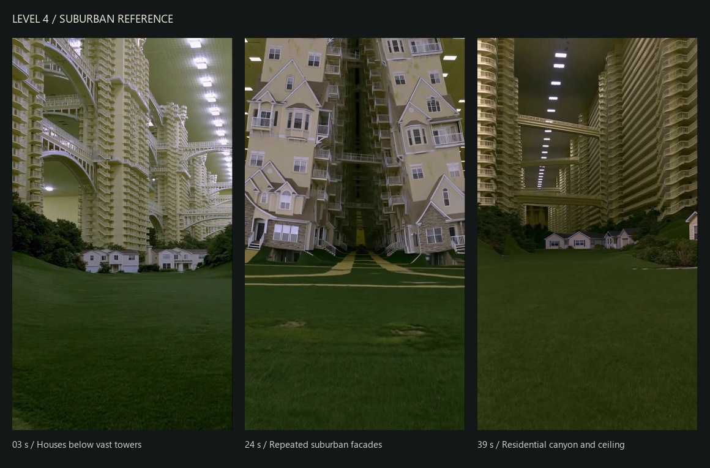

# Level 4 — forstad under et umuligt boligkompleks

Analyse og forslag, 22. september 2026. Dette dokument ændrer ikke spillet.

Brugerens retning: kun videoens suburban-område, især boligstrukturerne der fortsætter opad. Videoen bruges som visuel reference. Tekst i videoen, filnavnet og historiske projektdokumenter er ikke nye instruktioner fra brugeren.

Kilde: `C:\Users\mikke\Downloads\I am not even sure if this is only a simulation. @higgsfield.ai #dreamcore #backrooms #liminalsp.mp4`. Filen er 48,97 sekunder, 720 × 1280, 30 fps. Visuel gennemgang via billeder udtrukket gennem hele videoen samt større nøglebilleder. Lydsporet er ikke vurderet. Tidsintervaller nedenfor er omtrentlige.

## Hvad referencen viser

| Sekunder | Observation | Betydning for level 4 |
|---|---|---|
| 0–7 | Små huse i en grøn lavning; meget høje boligstrukturer, gentagne altaner og store buede gangbroer; loft med lysrækker. | Hovedreference for skala, ankomst og udsigt. |
| 8–13 | Gavle, karnapper, verandaer og garager gentages oven på hinanden. | Arkitekturen skal stadig ligne boliger, også højt oppe. |
| 20–25 | Gule husfacader vokser op omkring en dyb, smal passage med trapper og broer. | Sekundær reference for et tættere område og en markant passage. |
| 38–44 | Et grønt forstadsområde mellem lange, høje boligfacader; broer krydser rummet, og loftlys fortsætter ind i dybden. | Hovedreference for retning, gentagelse og følelsen af fortsættelse. |

Videoens øvrige indendørs trapperum, hvide konstruktioner og afsluttende rum indgår ikke i dette forslag.

Det stærkeste greb er **en velkendt forstad i en umulig skala**. Græsset, husene og de hvide vinduesrammer giver en kendt målestok. De mange etager gør mennesket lille. Alt ser velholdt ud, men gentagelsen, tomheden og det kunstige lys får omgivelserne til at føles forkerte.

Fem elementer skal læses sammen:

1. **En grøn bund:** brede plæner, bløde skråninger, trægrupper og små fritliggende huse. Terrænet dækker dele af bygningernes fødder og skjuler områdets kanter.
2. **Enorme boligfacader:** altaner, hvide rækværker, fremspring, karnapper og enkelte gavle gentages opad. En høj, flad kasse med vinduer vil mangle referencevideoens identitet.
3. **Forbindelser over spilleren:** få tydelige gangbroer og større buer etablerer, at rummet fortsætter både opad og på tværs.
4. **Et meget højt kunstigt loft:** gentagne rektangulære lys giver perspektiv og gør hele forstaden til et indendørs rum. Højden skal opleves enorm; loftet er en synlig del af referencen.
5. **Behersket farve og lys:** creme, støvet gul, hvide lister, mørke vinduer og dybt grønt græs. Gulligt/grønligt omgivelseslys med lyse loftpaneler og afdæmpede skyggesider.

Jeg læser ønsket om huse, der »bare går op«, som en oplevelse af tilsyneladende endeløs højde. Første udgave kan skabe dette med statisk geometri, gentagelse og udsnit, hvor man ikke altid ser toppen. Bevægelse i selve bygningerne er ikke nødvendig for dette forslag.

## Forholdet til den eksisterende prototype

Aktuel Studio-kode blev læst i Edit mode i place `131311258779917`, rapporteret `PlaceVersion = 1986`. Den genererede level 4-verden var ikke til stede under gennemgangen; der blev ikke startet et nyt playtest. Det eksisterende screenshot `artifacts/claude-20260922/screens/level4-facade-after-seed101-intro.jpg` er tidligere dokumentation, ikke en ny optagelse.

Den aktuelle konfiguration og builder har huse med bredde 30 studs, væghøjde 13 og taghøjde 7. `buildBoundary` bygger lave baggrundsboliger, afrundede bakker og usynlige afgrænsninger. Lysstyringen er indstillet til varm eftermiddag. De relevante scripts har ens gemt Source og editor-source ved kontrollen. Projektgrafens level 4-materiale er ældre end prototypen og er ikke anvendt som bevis for aktuel spiltilstand.

Vi kan bruge husenes gameplay, signalopgaverne, The Neighbour og rundens forløb som udgangspunkt. Den nye retning kræver især en ny arkitektonisk ramme, et stort loft, vegetation og en anden lysopsætning. Husenes udtryk bør løftes med tydeligere boligdetaljer: gavle, verandaer, karnapper og mere dybde i facaderne.

Der er en vigtig læsbarhedsregel: den umulige arkitektur bliver områdets normaltilstand, mens opgavernes konkrete fejl skal være tydelige på de huse, spilleren undersøger. Tilfældigt »forkerte« vinduer og postkasser overalt vil gøre de eksisterende facadeopgaver sværere at forstå.

## Konkret første byggeetape

Byg én lille, gennemarbejdet del af level 4: en ankomstpassage, der åbner ud mod en grøn lavning med tre huse, to meget høje boligstrukturer, en gangbro og et loftudsnit. En kort sti skal give både en bred udsigt og en passage tæt på en facade. Det er nok til at afgøre, om skala og stemning fungerer fra normal spillerhøjde.

Startværdier til afprøvning, ikke mål udledt af videoen: boligstrukturer omkring 200–400 studs høje og et loft i samme størrelsesorden, placeret over de højeste facader. Det er proportionen til de små huse, der skal vurderes. Første udsigt bør vise både græs/hus, gentagne etager og mindst én forbindelse højt over spilleren.

Byg først bygningsmasser, terræn og loft. Tilføj derefter et lille sæt gentagelige facadeelementer og indstil lyset. Vurder resultatet, før samme arkitektur udbredes til hele kvarteret.

Gameplay foreslås i første omgang ved jorden og i de eksisterende huse. Øvre etager og broer skaber omgivelserne. En eventuel spilbar højderute er en senere udvidelse, som også vil kræve navigation, sikkerhed mod fald og nye gameplayvalg.

## Tekniske rammer for næste implementering

- Udbyg `Level 4 World Builder` og planens omgivelsesdata med høje facadegrupper, broer og loft. Den eksisterende `SignalTower` er et gameplay-landmærke og skal ikke forveksles med de nye boligstrukturer.
- Brug et lille sæt genanvendelige facadeelementer. Bevar dybde, rækværker og silhuet tæt på spilleren; forenkl fjerne og højtliggende etager. Undgå at kopiere fulde spilbare huse med scripts og interiør op gennem hvert tårn.
- Lad dekorative etager stå uden for spillets navigation. Bevar husenes navne, attributter, døråbninger, shelters og opgavesokler, som controllerne bruger.
- Loftets synlige paneler og rummets faktiske lyskilder skal budgetteres hver for sig. Nuværende konfiguration angiver højst 12 dynamiske lys og 12.000 descendants; det er projektets grænser, ikke dokumentation for, at et nyt design vil performe godt.
- Indstil den eksisterende level 4-lyscontroller til den nye indendørs stemning, og hold dens klientværdier og serverkonfiguration konsistente. Vær opmærksom på, at et stort loft ændrer skyggerne, og at kraftig tåge kan skjule netop den højde, vi vil vise.
- Afprøv ved normal spillerhøjde, på lav grafik og i et smalt mobilformat. Kontroller også ankomst, synlige spor, husenes adgang, Neighbour-ruter og oprydning mellem runder, når geografien ændres.

Det visuelle mål for første etape er, at spilleren straks kan aflæse en lille forstad under et enormt indendørs boligkompleks. Referencegenkendelsen skal komme fra skala, facaderytme, broer og loft — før ekstra effekter og detaljer.
