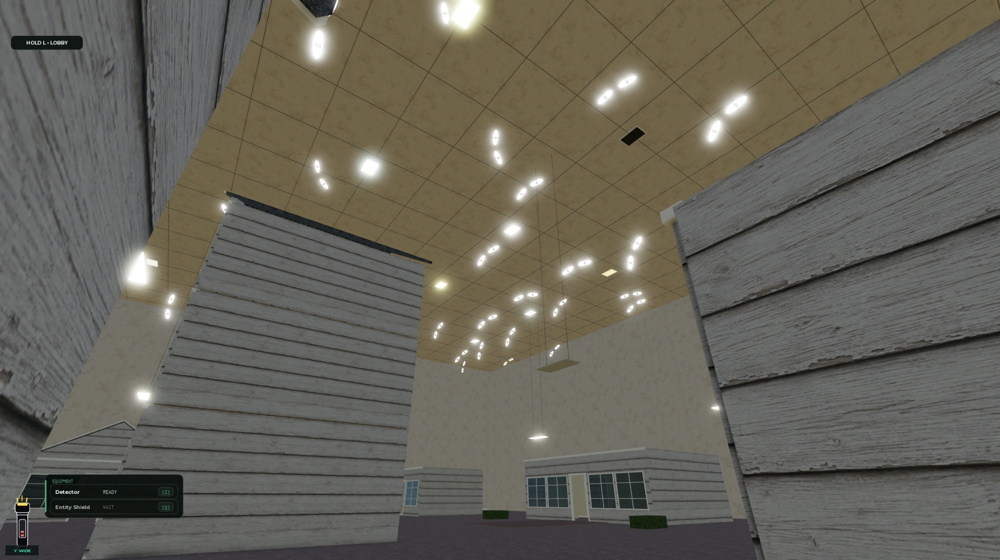

# Level 5 exit ceiling eyes and outage exemption — 26 September 2026

The final house courtyard now has 48 pairs of large ceiling eyes. They smoothly face living round participants near the exit, distribute attention between nearby players, and return to their authored resting orientation when the local player leaves the area. Tracking runs locally without remotes, damage, or camera changes. The final section and its descent retain their lighting during the earlier districts’ power outage; opening gate 7 does not extend that outage.

Final geometry contains **192 noncolliding BaseParts, 192 ellipsoid SpecialMeshes, and 96 Neon lenses**. No dynamic `Light` instances were added. The generated world measured **29,928 descendants**, below the existing 30,000 limit. This count is a generation-budget check, not a device-performance benchmark.

Native Studio checks passed:

- **Eye tracking:** all 48 rigs tracked the actual client from east and west positions. Minimum direction-to-player dot products were 0.999999106 and 0.999999225. Maximum measured mount-position error was 0.00274 studs; rotation preserved the mounted geometry. Returning to district G produced `REST`, zero targets, and all 48 valid rigs. Evidence: `final-eyes-east.json`, `final-eyes-west.json`, and `final-eyes-rest-G.json`.
- **Outage cycle:** `outage-final.json` passed a complete 71.17-second observation with zero failures or restoration mismatches. It covered 25 NORMAL, 29 FALLING, 347 BLACKOUT, and 1 RECOVERING samples, with 144 ambient comparisons in A–G and 194 in H. Server originals included 421 fixtures; streaming allowed 379 unique fixtures to be observed across all eight districts. All currently streamed originals were restored at expiry. This does not claim simultaneous client observation of all 421 fixtures.
- **Gate schedule:** native developer bypasses opened gates 1–7. Gate 7 preserved serial 6 and the exact existing restoration deadline. These checks exercised the actual gate/outage integration; they were not a seven-puzzle solution run. Evidence: `native-gates.json` and the native session records.
- **Local tests:** 303,940 outage-logic assertions, 39 lifecycle assertions, and 55 mocked eye-selection assertions passed. Mocked group selection is separate from native multiplayer validation.

Two intermediate versions were rejected: native spherical Parts rendered the thin lenses incorrectly, and the subsequent six-part/six-mesh version exceeded the generation cap. The delivered version uses four ellipsoid parts per pair and passed the final native checks above.

Final export verification found **193 scripts with exact repository bytes**: four existing task scripts changed and one client script was added. A separate concurrent `TunnelLobbyBuilder` edit was preserved: the sealed Level 4/5/6 development estimates changed to 90/70/30. It was not authored by this task. **187 baseline scripts, including all 12 Level 4 scripts, remained unchanged.** The prior cursor and surface fixes remain in place. Evidence: `final-source-mirror-report.json`.

A full native backup was captured as `artifacts/level5-exit-eyes-20260926/after.rbxl`: **9,821,563 bytes**, SHA-256 `0a1bab9bc1510b952ef85c335e8df4f2bf953edbb447fa107da3da29bc59b7f1`. Native File → Publish to Roblox succeeded as **v2143 at 2026-09-26T21:09:18.148Z**, verified from Studio’s publication log. The Git commit/push receipt is recorded separately when delivery completes.

Validation used one native Studio client. Real multiplayer target distribution, physical mobile devices, and a full performance profile remain unverified. No changes to puzzle answers, entities, rewards, or Level 4 behavior are claimed by this task.
