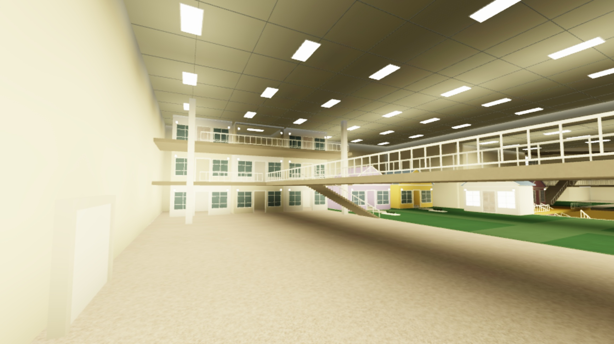
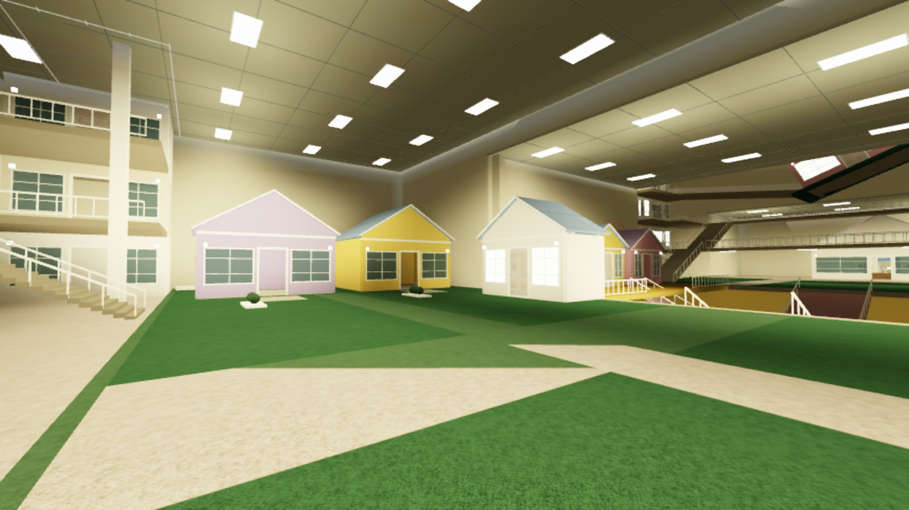
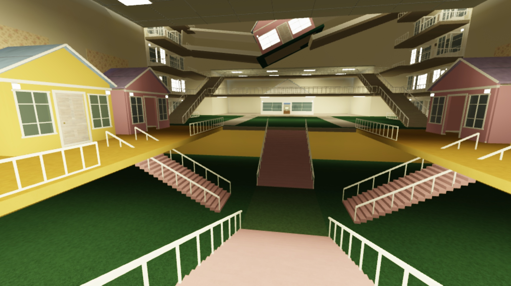
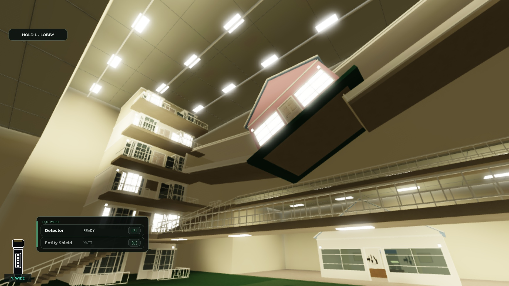
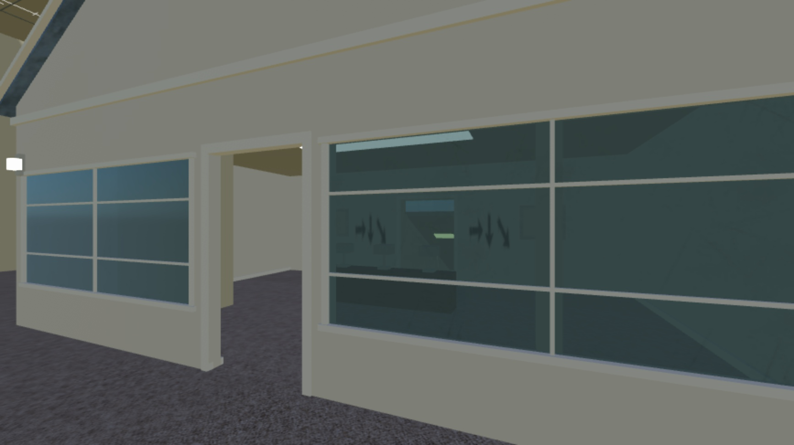
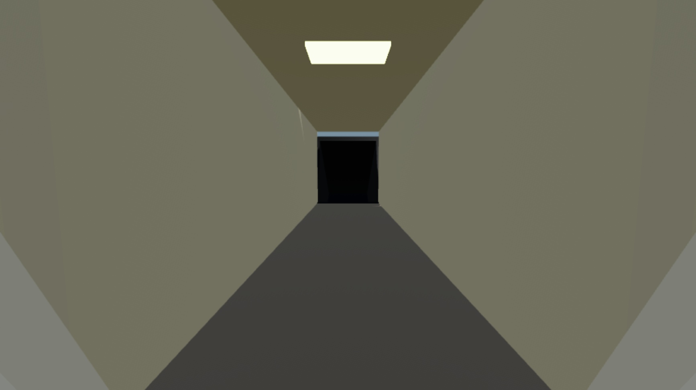

# Level 5 — The Indoor Suburbs

Updated 2026-09-23 after Studio Play revision 2, the final 174-source Studio export and **successful Roblox publication v2026 at 21:05:06 UTC**. This document describes the new map and developer preview. GitHub delivery is recorded separately from Roblox publication.

## Scope and visual direction

The user's final instruction moved the indoor residential Backrooms concept to **Level 5** and left **Level 4 untouched**. This is a map-only delivery. Zyntra is the researchers' organization; it did not create or own this unexplained place.

The map translates the eight supplied reference images into one connected indoor route: pale domestic walls and white trim, ordinary windows in impossible positions, repetitive balconies, carpet outdoors, miniature pastel houses beneath office ceilings, porch streets at different heights, and house volumes fused into tall residential stacks. Large exterior landscapes are replaced by bounded indoor courts. Lower levels are traversable; some high floors are scenery.

| Zone | Built environment and exploration |
| --- | --- |
| A — Balcony Atrium | Cream residential façades under a fluorescent office ceiling; carpeted floor, two balcony levels, real stairs, bridge, rail openings and an upper stairwell. |
| B — Pastel Carpet Court | Rose, blue, lavender and yellow gabled houses around green carpet resembling lawn; beige crossing paths and accessible house interiors. |
| C — Sunken Porch Street | Lower green-carpet street, pink carpet stairs, raised yellow porches, small house fronts and floral wallpaper; paths connect the different elevations. |
| D — Impossible House Stacks | Tall indoor residential stacks with bay windows, balconies, lower and upper stairs, bridges, tilted masses and embedded house volumes. The ceiling stays enclosed across height changes. |
| E — Final House and Chute | A domestic interior with empty picture frames and unwired three-lamp puzzle set dressing. Its rear route is open for preview and leads past arrows into a narrow sloping corridor and dark, contained landing. |

The final house is prepared for the later easy puzzle. **There is no functional puzzle, locked puzzle door, entity, chase, scripted controllable slide, win trigger or reward in this delivery.** The future slide annotation places its start at 70% of the descent, leaving the final 30% for sliding. Current chute geometry can be inspected without completing the level.

## Architecture contract

`Level5Architecture.lua` exposes `Build(parent, origin, config)` and returns `Model`, `SpawnCFrame`, `PreviewCameras`, `Waypoints`, `FinalHouse`, `ChuteStart`, `ChuteEnd` and `Bounds`.

- Runtime origin: `(17000, 24, 0)`, isolated from the lobby and existing levels.
- Local bounds: `(-111, -30, -5)` to `(111, 90, 395)`.
- Spawn is an HRP-height pose at local `(0, 3, 5)`, facing `+Z`.
- Chute geometry: local start `(0, 0, 344)`, bend `(0, -11, 371)`, end `(0, -28, 386)`, with a contained landing beyond it.
- Architecture performs no lighting, quest or entity mutations. The installed revision builds 4,876 architecture parts with 35 local lights; 5,092 world descendants including textures and containers.

## Generated textures

The adapter receives these asset strings as its `CarpetTexture`, `FloralTexture` and `ArrowTexture` attributes. Source PNGs and `assets/level5/asset-manifest.json` accompany the build.

| Attribute | Roblox asset | Source file |
| --- | --- | --- |
| CarpetTexture | `rbxassetid://78670100328161` | `assets/level5/level5-beige-carpet.png` |
| FloralTexture | `rbxassetid://87982596857809` | `assets/level5/level5-floral-wallpaper.png` |
| ArrowTexture | `rbxassetid://129457371506376` | `assets/level5/level5-chute-arrows.png` |

## Runtime and access

New instances:

- `ServerScriptService.Level 5 Systems.Level 5 Architecture`
- `ServerScriptService.Level 5 Systems.Level 5 Round Adapter`
- `ServerScriptService.Level5Generator`
- `ServerScriptService.Level5GateAccess`
- `StarterPlayer.StarterPlayerScripts.Level 5 Lighting Controller`

The adapter owns `Workspace.Level 5 Generated World` and `ReplicatedStorage.Level 5 State`, creates the existing elevator/`MazeStart`/`WorldGenerated` entry handshake, and cleans up its own state. It suspends and restores relevant Level 1 runtime systems for preview. Lighting ownership is independent through `Level5LightingOwnedByController`; snapshots restore the prior settings rather than applying a guessed lobby grade.

The existing developer allowlist is reused:

| Developer | User ID |
| --- | --- |
| mikkelczar | `40920547` |
| LaverSneglen | `9488575949` |

With `Workspace.Level5DevEnabled` enabled, only these developers receive per-character `NoCollisionConstraint` objects against the exact `Level5SealedDoor`. The wall remains solid for other players. Queue stations exist behind the sealed wall; public Level 5 access is not enabled. Constraints are maintained for accessories and respawns and removed on cleanup. A Studio flag-off test removed all gate constraints and the character stopped at the wall; the flag was then restored.

Shared changes are limited to `GameManager`, `Round Completion Routing`, `TunnelLobbyBuilder`, `Round Entry Client` and `RoundUI`. Admission, launch, prepare, start and reserved-server roster paths check the exact requested level's developer flag and the whole party's allowlist. `MaxLevel = 3` and existing `DevLevel = 4` remain; the separate highest developer level becomes 5. Level 5's flag cannot bypass Level 4's flag. No normal Level 3 continuation to Level 4 or 5 was introduced. `ServerStorage.Level5DevStart` supplies a server-only developer entry hook.

## Studio return fix

Studio's existing local leave handler requires `LobbySpawn` to remain under Workspace. Parking the lobby in ServerStorage made it reject the return request. The Level 5 adapter now skips lobby parking when `RunService:IsStudio()` is true. The far-away map stays isolated, local lobby return works, and published reserved-server behavior keeps its existing parking/teleport route. Level 4 was not changed to implement this fix.

Play revision 2 confirmed holding **L for 2.5 seconds** returned the character to the lobby, cleared `InRound`, then removed the Level 5 world after about six seconds. `SelectedLevel` returned to 1 and `RoundActive` became false. Developer re-entry returned true.

## Concurrent work preserved

Studio was read before edits and compared again inside installation writes. A concurrent GameManager change was caught before overwrite; the integration was regenerated against the fresh source. The initial 168-source export remains intact, with a separate latest shared-script export.

- `QUEUE_FULL_FASTSTART_20260923`: full parties receive the shorter queue countdown.
- RoundUI death-card/PartyDown layout: measured overlap correction and deferred relayout for laptop viewports.
- `CHALLENGES_20260923`: developer-touched run tracking, per-run death/revive/escape/equipment/paid-aid/solo facts, wall-clock timing, and completion-event run metadata.
- The final export also contains the other developer's new `ReplicatedStorage.ZyntraChallenges` module and changes to `ZyntraConfig`, `ZyntraDetectorService` and `ZyntraMonetization`; these are identified separately in `artifacts/level5-20260923/studio-source-verification.json`. They were not authored or functionally certified as part of Level 5.

These belong to the other developer's live Studio work and were retained while applying the scoped Level 5 changes. Final export and commit notes must retain their provenance rather than presenting them as new Level 5 features.

All 12 Level 4 sources were verified identical to the initial authoritative Studio baseline after this work.

## Delivery status and next work

See `LEVEL5_QA_2026-09-23.md` for test scope and limitations. Studio entry, navigation, local return, cleanup and re-entry have passed. Final Studio export contains 174 scripts with zero editor/source conflicts.

The existing experience, place `131311258779917`, universe `10559217407`, was **published as v2026 on 2026-09-23 at 21:05:06 UTC**. The current Studio session logged `PublishSuccessful`, confirmation that new changes were published to Roblox, player availability, and the v2026 publish-notes link. The filtered receipt is `artifacts/level5-20260923/publish-log-v2026.txt`, with metadata in `publication-v2026.json`. This was a publish, not an active-server restart.

Delivery branch: `codex/level5-indoor-suburbs`. The native post-change backup is `output/level5-build/Backrooms-Level5-v2026.rbxl` (9,462,909 bytes). Both native backup hashes are recorded in `artifacts/level5-20260923/native-backups.json`; binaries are preserved locally. The map-delivery checklist and GitHub links are recorded on the Trello card; deferred gameplay remains open.

Trello: [Level 5 — The Indoor Suburbs · map og dev-preview](https://trello.com/c/Y2xXThBN). Complete only the map-delivery checklist items supported by evidence. Keep the later entity/puzzle/slide/completion gameplay work open. Historical Level 4 handoff information remains Level 4 history.

## Captured map views

These are actual Studio captures of revision 2, not generated concept images.

