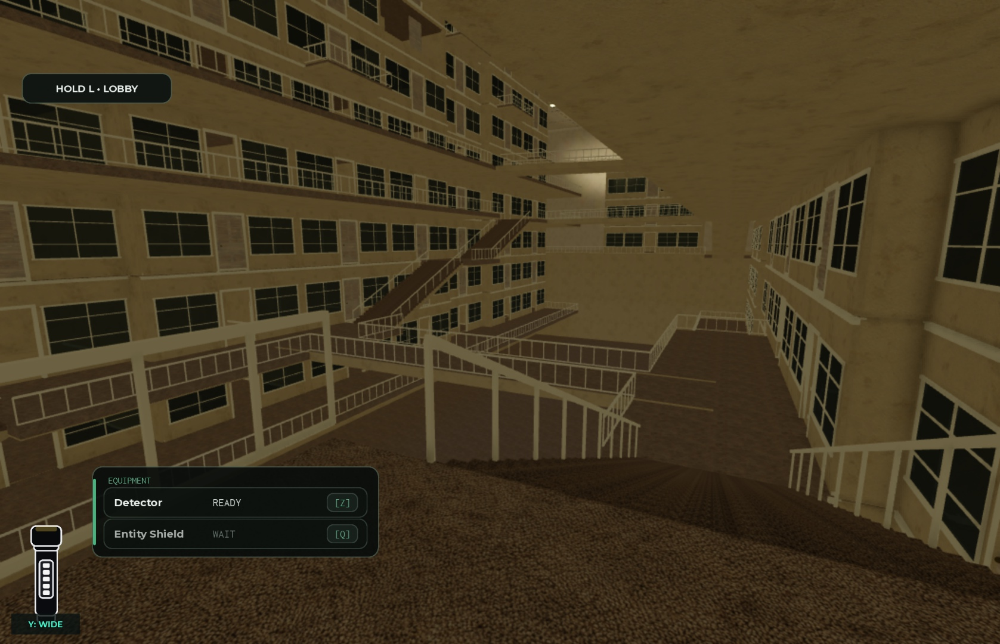

# Level 5 — reference residential atrium

Published to place **131311258779917** as **v2136**, confirmed by native Studio at **2026-09-26 18:46:47.404 UTC**. Level 5 remains the existing developer preview.

## Map change

Section F replaces the wide window courts with continuous cream plaster dwellings around a narrow, deep residential atrium, following the two supplied photographs. Carpeted landings overlook lower floors; white balustrades, recessed façades, cutaway upper rooms, projecting balconies and staggered bridges break up the opposing walls. Shared fluorescent ceiling fixtures provide light; the homes contain no lamps or luminous windows. Balcony undersides are plaster, with carpet only on top.

The playable floors run from local −42 to +28 studs, upper dwellings reach +70, and the ceiling is at +84. The main route descends, crosses the void, climbs to an offset crossing and descends again to the existing exit. A separate staircase route returns players from the pit floor to the main path. The TV clue occupies an accessible house; all three original F Watcher names remain on supported, visible tinted panes.

F contains **167 dwellings, 62 enterable homes, 344 windows and 9,146 BaseParts**. The whole generated world contains **29,626 descendants**, below its existing 30,000 limit. The other seven districts and all 12 Level 4 scripts are preserved. No entity behavior, puzzle logic, access rules or outage timing changed.

## Verification

- Final closed and open gate audits each passed **5,651 bounded rays**, including enclosure seams, pit support, path/head clearance, gates 5/6, clue placement and the three Watcher sightlines.
- Normal Humanoid movement passed the **28-point main route in 74.11 seconds**. This run preceded 21 thin underside additions; final geometry probes cover those additions. The final **12-point recovery route passed in 52.79 seconds**, the clue approach in 2.19 seconds, and the opened exit threshold also passed. The runner never teleported or changed speed during a route; characters were staged at each route's start.
- Real mouse/keyboard input set the TV puzzle to **CH04 / CH07 / CH02**. The server reported `SOLVED`, `Puzzle6Solved=true` and `FullyOpen=true`.
- A fresh gate-6 outage observed **343 streamed fixtures across 559 samples**. Schedule: five-second falling phase and 60 full seconds of blackout. Zero darkness failures, zero changes to originally failed tubes, and zero restoration mismatches.
- Both changed modules compile. All **192 native Source/editor exports** match the repository exactly: two changed modules, 190 unchanged scripts. G/H construction and shared helpers were independently reviewed against the baseline. Temporary QA objects were removed when Play stopped; HttpEnabled returned to false.

These are bounded navigation/geometry and local-client checks, not exhaustive coverage of every dwelling or two-player encounter behavior.

## Performance limitation

Performance is **not approved by this session**. Quality-10 measurements averaged 11.85 FPS in F and 6.56 FPS in unchanged A. This 8 GB Mac was using about 17.9 GB of swap, so the measurements do not isolate the new section from Studio/system load. Earlier measurements remain historical evidence only. Physical mobile/tablet, multiplayer load and a clean performance run remain unverified.

## Records

Artifacts are in `artifacts/level5-atrium-reference-20260926/`: full native `after.rbxl`, publication log/receipt, source parity report, route/geometry/outage results, performance measurements, and before/after images. The backup is **9,790,056 bytes**, SHA-256 `b117548bc9d4a4f4ed999f32871e6ffc10755548df7bf28ac3a90b8609b250e3`.

Source hashes:

- Architecture: `b350d235befe950b220ed101216762015b4ae860620827b23b39d72b180e9145`.
- Landmark Districts: `8b0f2a636fd6294cfd87cd10729134c5f4b5acccffa924935454da25869a0466`.

The [Level 5 Trello card](https://trello.com/c/Y2xXThBN) retains separate future work for the main entity and final sliding/completion gameplay. This revision is delivered through [PR #10](https://github.com/ERN-Studios/ERN-Roblox-Horror/pull/10).

