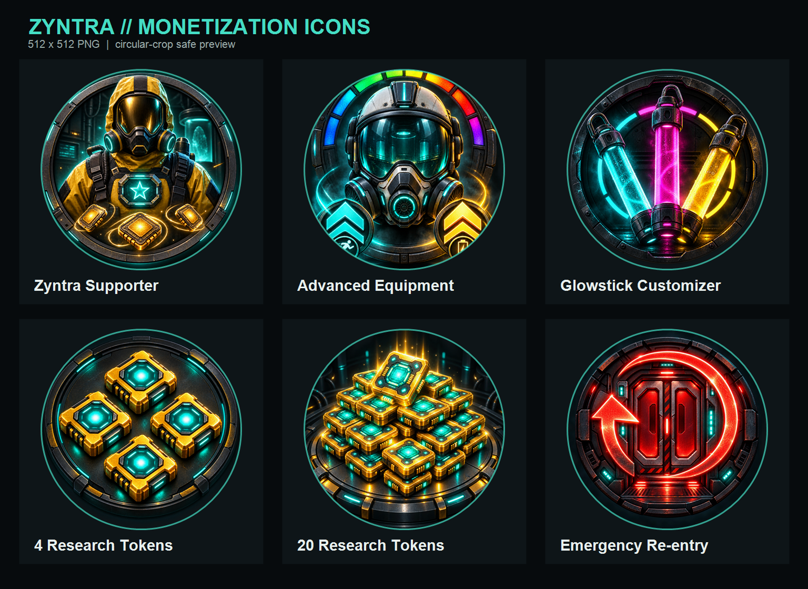

# Zyntra monetization: analyse og opsætningsguide

Senest kontrolleret: 27. august 2026. Alle 12 Creator Dashboard Asset IDs er indsat og verificeret mod experience `10559217407`.

## Anbefalet launch-katalog

Zyntras nuværende opdeling er grundlæggende rigtig: permanente fordele er Game Passes, mens valuta og forbrug er Developer Products. Supporter bør ikke være en subscription ved første release.

| Intern nøgle | Dashboard-navn | Roblox-type | Basispris | Asset ID | Spillerens køb |
|---|---|---|---:|---:|---|
| `Supporter` | Zyntra Supporter | Pass | 99 R$ | `1941938256` | 10 Research Tokens én gang og permanent supporter-tag |
| `AdvancedEquipment` | Advanced Equipment | Pass | 149 R$ | `1945402536` | Én permanent +5% stamina-opgradering, én permanent +5% batteri-opgradering og hazmat color picker |
| `CosmeticEquipment` | Glowstick Customizer | Pass | 99 R$ | `1946086261` | Permanent glowstick color picker |
| `Tokens4` | 4 Research Tokens | Developer Product | 49 R$ | `3707755089` | 4 tokens; kan købes igen |
| `Tokens20` | 20 Research Tokens | Developer Product | 149 R$ | `3707755233` | 20 tokens; kan købes igen |
| `EmergencyReentry` | Emergency Re-entry | Developer Product | 29 R$ | `3707755318` | 1 gemt re-entry-credit; kan købes igen |
| `DonationSignal` | Donate Signal | Developer Product | 10 R$ | `3710116814` | Frivillig donation; ingen gameplay-fordel |
| `DonationSupply` | Donate Supply | Developer Product | 50 R$ | `3710116945` | Frivillig donation; ingen gameplay-fordel |
| `DonationField` | Donate Field | Developer Product | 100 R$ | `3710117017` | Frivillig donation; ingen gameplay-fordel |
| `DonationResearch` | Donate Research | Developer Product | 250 R$ | `3710117070` | Frivillig donation; ingen gameplay-fordel |
| `DonationCommand` | Donate Command | Developer Product | 500 R$ | `3710117099` | Frivillig donation; ingen gameplay-fordel |
| `DonationDirector` | Donate Director | Developer Product | 1.000 R$ | `3710117136` | Frivillig donation; ingen gameplay-fordel |

`Glowstick Customizer` er et anbefalet klarere kundenavn end det nuværende `Cosmetic Equipment Packs`, fordi passet kun indeholder glowstick-farven. Den interne nøgle kan fortsat hedde `CosmeticEquipment`.

## Færdig ikonpakke

De seks uploadklare filer ligger i `assets/monetization/icons-512`. De er præcis 512 x 512 PNG, uden pris eller tekst i motivet, og er visuelt kontrolleret med Roblox' cirkulære beskæring.



Filnavne, full-resolution masters og det anvendte prompt-set er dokumenteret i `assets/monetization/README.md`.

### Tekster til Creator Dashboard

**Zyntra Supporter**

> Receive 10 Research Tokens once and unlock a permanent ZYNTRA SUPPORTER tag.

**Advanced Equipment**

> Permanently unlock the hazmat color picker and receive one +5% upgrade to both Stamina Capacity and Battery Capacity.

**Glowstick Customizer**

> Permanently unlock the glowstick color picker for every glowstick you deploy. Cosmetic only.

**4 Zyntra Research Tokens**

> Adds 4 Research Tokens to your account. Spend each token on a permanent +5% upgrade to either Stamina Capacity or Battery Capacity.

**20 Zyntra Research Tokens**

> Adds 20 Research Tokens to your account. Spend each token on a permanent +5% upgrade to either Stamina Capacity or Battery Capacity.

**Emergency Re-entry**

> Adds 1 stored Emergency Re-entry credit. After dying during an active run, use it to rejoin once that round.

**Alle seks Donate-produkter**

> Optional, repeatable donation toward continued development of Backrooms: No Way Out. Grants no items or gameplay advantages.

## Nuværende status i spillet

- Alle 12 køb er implementeret i UI og serverscript.
- Alle 12 `Id`-felter er udfyldt og verificeret mod den aktive experience.
- Data gemmes i `ZyntraPlayerData_v1`.
- Én token giver permanent +5% til enten stamina- eller batterikapacitet uden maksimum.
- Hver gennemført level giver 1 gratis token, også ved gentagne clears.
- Supporterens 10 tokens og Advanced Equipments to +5%-grants gives kun én gang via gemte grant-flags.
- Developer Products behandles centralt gennem `MarketplaceService.ProcessReceipt`.
- En global Top Donors-tavle summerer kun den præcise `CurrencySpent` fra de seks dedikerede donationers receipts i `ZyntraDonationLeaderboard_v2`. Utility-produkter og passes tælles ikke med. Den nye v2-tavle migrerer bevidst ikke gamle utility-køb.
- Supporter giver ikke længere adgang til hazmat-styling; den ligger udelukkende i Advanced Equipment.
- Butikken henter aktuelle/personaliserede Roblox-priser og bruger Config-prisen som fallback.
- Studio giver automatisk alle passes og starter spilleren med 25 tokens; Studio kan derfor ikke bevise, at rigtige køb virker.
- Zyntra-butikken viser tekstkort. Ikonerne bruges straks på Roblox' købssider, men kræver en senere `ImageLabel`-udvidelse for også at blive vist i spillets terminal.

## Release-vurdering

### Klar til opsætning

- Zyntra Supporter
- Advanced Equipment
- Glowstick Customizer
- 4 Research Tokens
- 20 Research Tokens

### Opret, men behold off-sale indtil re-entry-flowet er rettet

Emergency Re-entry har i øjeblikket tre problemer:

1. Wipe-/købsvinduet er kun cirka 15 sekunder.
2. Et køb giver først en credit; spilleren skal derefter nå at trykke igen for at bruge den.
3. Spilleren bliver respawnet, før DataStore-mutationens credit-forbrug er bekræftet. En save-fejl kan derfor give et gratis respawn.

Før salg anbefales et 45-60 sekunders vindue, auto-use efter en godkendt receipt og et atomisk reserve/consume-flow med rollback ved afvist respawn.

## Økonomisk analyse

- 4-pakken koster 12,25 R$ pr. token.
- 20-pakken koster 7,45 R$ pr. token.
- 20-pakken er dermed cirka 39,2% billigere pr. token end fem 4-pakker. Det er en tydelig, men forståelig volumenrabat.
- Supporter giver 10 tokens for 9,9 R$ pr. token plus kosmetiske fordele. Det fungerer godt som en attraktiv engangs-startpakke uden at kunne genkøbes.
- Fordi spillere også får gratis tokens for clears, er modellen pay-to-progress og ikke en ren betalingsmur.
- Uendelige, lineære +5%-opgraderinger og uendelig farming af det letteste level kan på sigt fjerne survival-spændingen. Behold gerne designet til første telemetry-test, men mål clear-rate, gennemsnitligt upgrade-level og tokenkøb. Overvej derefter diminishing returns eller first-clear/daily rewards.

## Trin 1: publicér den rigtige experience

Spillet skal være publiceret og tilgængeligt på Roblox, før passes kan oprettes.

1. Åbn den korrekte Studio-version af `Backrooms: No Way Out`.
2. Vælg `File -> Publish to Roblox`.
3. Kontrollér, at Creator/Group og experience er den samme, som monetization skal udgives under.
4. Åbn [Creator Dashboard](https://create.roblox.com/dashboard/creations) og vælg den nuværende experience `Backrooms: No Way Out`.

Opret alle produkter under den samme experience. Roblox deaktiverede cross-game-salg af passes og Developer Products den 30. maj 2026.

## Trin 2: opret de tre passes

Gentag dette for `Zyntra Supporter`, `Advanced Equipment` og `Glowstick Customizer`:

1. Gå til `Creations -> Backrooms: No Way Out -> Monetization -> Passes`.
2. Klik `Create pass`.
3. Upload det matchende 512 x 512 PNG-ikon fra `assets/monetization/icons-512`.
4. Indsæt navn og beskrivelse fra tabellen ovenfor.
5. Vælg en passende shop-kategori og klik `Create pass`.
6. Åbn passet og gå til `Sales`.
7. Slå `Item for Sale` til, angiv basisprisen og gem.
8. På passets tile: `... -> Copy Asset ID`.
9. Sammenlign det kopierede ID med tabellen øverst; de seks IDs er allerede indsat i koden.

Managed Pricing er automatisk aktivt for passes. Det kan give regionale priser helt ned til 30% af basisprisen. Anbefalingen er at beholde det aktivt, men kun når Zyntra-terminalen viser dynamiske priser.

## Trin 3: opret Developer Products

Gentag dette for de tre utility-produkter og de seks frivillige Donate-produkter:

1. Gå til `Creations -> Backrooms: No Way Out -> Monetization -> Developer Products`.
2. Klik `Create developer product`.
3. Upload det matchende 512 x 512 PNG-ikon.
4. Indsæt navn, beskrivelse og basispris.
5. Klik `Save Changes`.
6. På produktets tile: `... -> Copy Asset ID`.

Managed Pricing er ikke automatisk aktivt for Developer Products. Lad det være slået fra under den første end-to-end-test. Når UI'et henter rigtige runtime-priser, kan det aktiveres; Zyntra har ingen token-gifting/trading, så den normale regional-price-arbitrage-risiko er lav.

## Trin 4: verificér de 12 Asset IDs

De 12 Asset IDs er allerede indsat i `ReplicatedStorage/ZyntraConfig.ModuleScript.lua`; donationerne ligger i den separate `Donations`-tabel.

```lua
Passes = {
	Supporter = { Id = 1941938256, ... },
	AdvancedEquipment = { Id = 1945402536, ... },
	CosmeticEquipment = { Id = 1946086261, ... },
},

Products = {
	Tokens4 = { Id = 3707755089, ... },
	Tokens20 = { Id = 3707755233, ... },
	EmergencyReentry = { Id = 3707755318, ... },
},
```

Roblox opkræver altid Dashboard-prisen. `Price` i ZyntraConfig er i øjeblikket kun fallback-/displaytekst og kan ikke styre den virkelige pris.

## Trin 5: verificér den dynamiske prisvisning før live launch

LocalScriptet henter den aktuelle pris på klienten og falder kun tilbage til Config-prisen, hvis Roblox-opslaget fejler. Det er nødvendigt på grund af Managed Pricing og personaliserede priser.

Den relevante implementering i `ZyntraStore.LocalScript.lua` svarer til:

```lua
local infoType = kind == "Pass" and Enum.InfoType.GamePass or Enum.InfoType.Product
local ok, info = pcall(MarketplaceService.GetProductInfoAsync, MarketplaceService, item.Id, infoType)
if ok and info and info.PriceInRobux then
	buy.Text = tostring(info.PriceInRobux) .. " R$"
end
```

Kald det fra klienten, så prisen er personaliseret til den konkrete spiller. Brug fallbackteksten fra Config, hvis opslaget fejler.

Efter ændringen kan op til fem testkonti få simulerede priser gennem:

`Monetization -> Passes/Developer Products -> ... -> Dynamic Price Check`.

## Trin 6: sikkerheds- og købstest

### Passes

Brug en testkonto, der ikke ejer passet:

1. Køb passet i en publiceret testserver.
2. Kontrollér, at fordelen aktiveres uden rejoin.
3. Rejoin og kontrollér, at fordelen stadig er aktiv.
4. Kontrollér, at Supporter-tokenpakken og Advanced-grants ikke gives igen.
5. Test en Supporter-only spiller og kontrollér, at hazmat color pickeren er låst. Test derefter en Advanced-only spiller og kontrollér, at den kan åbnes og gemmes.

### Developer Products

Test med et billigt testprodukt og en testkonto. Rigtige testkøb bruger rigtige Robux.

1. Køb 4-tokenproduktet.
2. Kontrollér præcis +4, rejoin og kontrollér persistens.
3. Køb igen og kontrollér endnu +4.
4. Gentag for 20-tokenproduktet.
5. Afbryd/rejoin omkring købet og kontrollér, at samme `PurchaseId` aldrig giver dobbelt grant.
6. Test receipt-flowet gennem lobby, reserved server og tilbage til lobby.

Developer Product-grants må kun gives gennem `ProcessReceipt`, aldrig gennem `PromptProductPurchaseFinished`. Zyntra bruger allerede den korrekte centrale callback, men en publiceret end-to-end-test er nødvendig.

Hvis Developer Products også skal sælges på Roblox' eksterne Store-tab:

1. `Monetization -> Developer Products -> ... -> External Purchase Settings`.
2. Aktivér test mode.
3. Tillad external purchases på ét billigt testprodukt.
4. Køb det på Store-tabben, join spillet og verificér grant.
5. Kontrollér, at receipt-status bliver `Closed`, før eksternt salg aktiveres bredt.

## Trin 7: launch-checkliste

- [ ] Ikoner uploadet til de produkter, der skal have egne billeder.
- [ ] Tre passes oprettet under Zyntra-experiencen.
- [x] Ni Developer Products oprettet under Zyntra-experiencen.
- [ ] Dashboard-priser og beskrivelser dobbelttjekket.
- [x] 12 Asset IDs indsat og verificeret i `ZyntraConfig`.
- [x] Dynamisk prisvisning implementeret.
- [ ] Dynamic Price Check bestået med testkonti.
- [ ] Supporter-token-grant testet som one-time.
- [ ] Advanced-grants testet som one-time.
- [ ] Token receipts testet for gentagne køb, rejoin og duplicate receipt.
- [ ] Top Donors-tavlen testet med donation-receipts, genstart og OrderedDataStore-fejl.
- [ ] DataStore testet i publiceret version.
- [ ] Emergency Re-entry-flow rettet og testet, før produktet sættes on-sale.
- [ ] Purchase-/receipt-fejl logges til analytics eller telemetri.
- [ ] Shop-copy forklarer tydeligt, at hvert token giver +5% til ét valgt system.

## Subscription-beslutning

Brug ikke en subscription ved første launch. Roblox-subscriptions er månedlige og auto-fornyende, mens den implementerede Supporter-fordel er permanent. Roblox har ingen indbygget ugentlig tokenudbetaling.

En senere `Zyntra Research Membership` kan give mening, hvis I vil tilbyde en reel løbende fordel, eksempelvis 10 tokens pr. betalingsmåned og et aktivt medlemsbadge. En ugentlig udbetaling kræver jeres egen periodisering, DataStore-felter, offline catch-up og serverkontrol af aktiv status. Subscription-fordele skal fjernes eller deaktiveres, når abonnementet ikke længere er aktivt.

## Kodepunkter

- Produktkatalog og ID-felter: `ReplicatedStorage/ZyntraConfig.ModuleScript.lua`
- Persistence, pass-grants og receipts: `ServerScriptService/ZyntraMonetization.Script.lua`
- Shop, prompts og nuværende prisdisplay: `StarterPlayer/StarterPlayerScripts/ZyntraStore.LocalScript.lua`
- Level-belønning og re-entry: `ServerScriptService/GameManager.Script.lua`
- Batteri-multiplier: `StarterPlayer/StarterPlayerScripts/FlashlightController.LocalScript.lua`
- Stamina-multiplier: `StarterPlayer/StarterPlayerScripts/NoiseReporter.LocalScript.lua`

## Officielle Roblox-kilder

- [Passes](https://create.roblox.com/docs/production/monetization/passes)
- [Developer Products](https://create.roblox.com/docs/production/monetization/developer-products)
- [Subscriptions](https://create.roblox.com/docs/production/monetization/subscriptions)
- [Regional Pricing](https://create.roblox.com/docs/production/monetization/regional-pricing)
- [Roblox Plus](https://create.roblox.com/docs/production/monetization/roblox-plus)
- [Player data and purchasing systems](https://create.roblox.com/docs/cloud-services/data-stores/player-data-purchasing)
- [MarketplaceService](https://create.roblox.com/docs/reference/engine/classes/MarketplaceService)
- [Publish games and places](https://create.roblox.com/docs/production/publishing/publish-games-and-places)
